# App Flow — Màn hình, luồng và trạng thái

| | |
|---|---|
| Phiên bản | 1.0 |
| Ngày | 2026-10-09 |
| Tài liệu liên quan | [PRD](PRD.md) · [TDD](TDD.md) · [Backend Schema](BACKEND_SCHEMA.md) |

Tài liệu này mô tả **màn hình ở mức chức năng** (mục đích, dữ liệu, thao tác, API được gọi) và **luồng nghiệp vụ** giữa các màn hình. Tài liệu không quy định bố cục hay giao diện, phần đó sẽ thiết kế sau.

---

## 1. Sơ đồ điều hướng

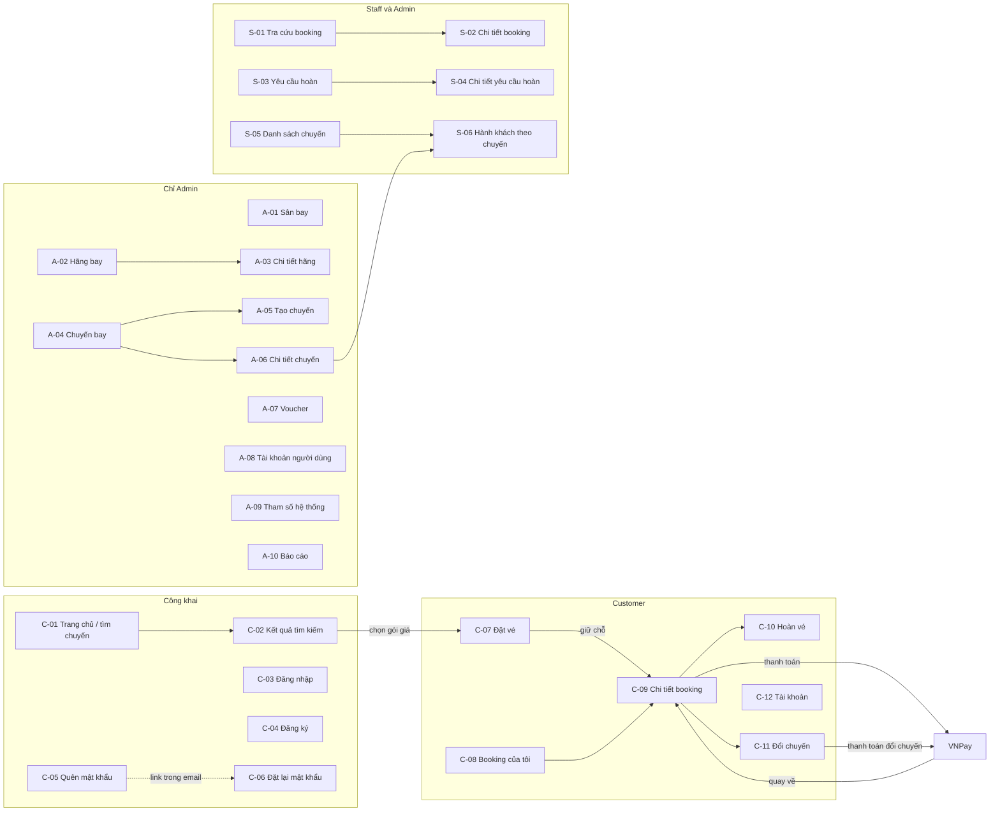

- C-12 (Tài khoản) dùng được cho mọi vai trò đã đăng nhập.
- Sau khi đăng nhập, mỗi vai trò có trang mặc định riêng: Customer vào `/bookings`, Staff vào `/staff/bookings`, Admin vào `/admin/flights`. Nếu URL có tham số `next` thì quay về `next`.

---

## 2. Danh sách màn hình

Cột "API" ghi đường dẫn bỏ tiền tố `/api`.

### 2.1 Công khai và Customer

| ID | Màn hình | Route | Quyền | Nội dung | Thao tác → API |
|---|---|---|---|---|---|
| C-01 | Trang chủ / tìm chuyến | `/` | Công khai | Form tìm: sân bay đi và đến (có gợi ý), ngày đi, ngày về (tuỳ chọn), số người lớn, trẻ em, em bé, hạng ghế | Gõ tên sân bay → `GET /airports?q=`. Bấm Tìm → mở C-02 |
| C-02 | Kết quả tìm kiếm | `/flights?from=&to=&date=&returnDate=&adults=&children=&infants=&cabin=` | Công khai | Danh sách hành trình theo FR-11, có lọc và sắp xếp ở client. Khứ hồi đi theo 2 bước: chọn chiều đi, sau đó chọn chiều về (luôn hiện tóm tắt chiều đi đã chọn) | Tải kết quả → `GET /flights/search`. Chọn gói giá → lưu lựa chọn vào `sessionStorage` rồi mở C-07 (chưa đăng nhập thì qua C-03 trước, đăng nhập xong quay lại C-07) |
| C-03 | Đăng nhập | `/login?next=` | Công khai | Email, mật khẩu | `POST /auth/login`, sau đó `GET /auth/csrf`, rồi chuyển về `next` hoặc trang mặc định của vai trò |
| C-04 | Đăng ký | `/register` | Công khai | Email, mật khẩu, họ tên, số điện thoại | `POST /auth/register`, sau đó xử lý như đăng nhập |
| C-05 | Quên mật khẩu | `/forgot-password` | Công khai | Email | `POST /auth/forgot-password`, rồi luôn hiện thông báo "đã gửi email nếu tài khoản tồn tại" |
| C-06 | Đặt lại mật khẩu | `/reset-password?token=` | Công khai | Mật khẩu mới, nhập lại mật khẩu mới | `POST /auth/reset-password`, xong thì mở C-03 |
| C-07 | Đặt vé | `/checkout` | Customer | Xem mục [C-07 chi tiết](#c-07-đặt-vé) bên dưới | Mỗi lần dữ liệu thay đổi → `POST /bookings/quote`. Tải bảng giá hành lý → `GET /airlines/{code}/baggage-options`. Bấm "Giữ chỗ" → `POST /bookings`, thành công thì mở C-09 |
| C-08 | Booking của tôi | `/bookings?status=` | Customer | Danh sách: mã đặt chỗ, tuyến, ngày bay, trạng thái, tổng tiền | `GET /bookings` |
| C-09 | Chi tiết booking | `/bookings/[code]?payment=` | Chủ booking | Toàn bộ thông tin theo FR-41. Đếm ngược hạn giữ chỗ nếu đang chờ thanh toán. Thông báo kết quả thanh toán nếu URL có `payment=` | Xem mục [C-09 chi tiết](#c-09-chi-tiết-booking) bên dưới |
| C-10 | Hoàn vé | `/bookings/[code]/refund/[direction]` | Chủ booking | Giá trị chiều, phí hoàn, số tiền được hoàn, ô nhập lý do | Mở trang → `GET /bookings/{code}/journeys/{direction}/refund-quote`. Bấm Gửi → `POST .../refund-requests`, xong quay về C-09 |
| C-11 | Đổi chuyến | `/bookings/[code]/reschedule/[direction]` | Chủ booking | Chọn ngày mới, xem danh sách hành trình thay thế kèm số tiền phải trả, xem báo giá, xác nhận | `GET .../reschedule-options?date=` → `POST .../reschedule-quote` → `POST .../reschedules`. Nếu phải trả tiền → `POST /reschedules/{id}/payments` rồi sang VNPay, xong quay về C-09 |
| C-12 | Tài khoản | `/account` | Đã đăng nhập | Hồ sơ, đổi mật khẩu, đăng xuất | `GET /me`, `PUT /me`, `PUT /me/password`. Đăng xuất → `POST /auth/logout` |

#### C-07 Đặt vé

Nội dung:
- Tóm tắt hành trình đã chọn.
- Form hành khách, đúng theo số lượng đã nhập lúc tìm kiếm (BR-10 đến BR-13). Các trường hộ chiếu chỉ hiện khi hành trình có chặng quốc tế.
- Thông tin liên hệ, điền sẵn từ tài khoản.
- Chọn hành lý mua thêm cho từng hành khách ở từng chiều.
- Ô nhập voucher.
- Bảng giá.

Khi bấm "Giữ chỗ":
- Gặp `SEATS_UNAVAILABLE` hoặc `FLIGHT_NOT_BOOKABLE` thì quay lại C-02 kèm thông báo.
- Gặp lỗi dữ liệu thì ở lại C-07 và đánh dấu từng trường bị lỗi.

#### C-09 Chi tiết booking

| Thao tác | Điều kiện hiện | API |
|---|---|---|
| Thanh toán | Booking `PENDING_PAYMENT` và chưa quá hạn | `POST /bookings/{code}/payments`, rồi chuyển sang VNPay |
| Huỷ giữ chỗ | Booking `PENDING_PAYMENT` | `POST /bookings/{code}/cancel` |
| Thanh toán đổi chuyến | Đang có yêu cầu đổi chờ thanh toán | `POST /reschedules/{id}/payments` |
| Hoàn chiều này | Chiều thoả BR-51 và BR-60 | Mở C-10 |
| Đổi chiều này | Chiều thoả BR-51 và BR-70 | Mở C-11 |

### 2.2 Staff (Admin cũng dùng được)

| ID | Màn hình | Route | Nội dung | Thao tác → API |
|---|---|---|---|---|
| S-01 | Tra cứu booking | `/staff/bookings?q=&status=` | Ô tìm theo mã đặt chỗ, email hoặc số điện thoại; lọc theo trạng thái; bảng kết quả | `GET /staff/bookings` |
| S-02 | Chi tiết booking | `/staff/bookings/[code]` | Như C-09, thêm tài khoản đã đặt và toàn bộ lịch sử thu, hoàn, đổi | `GET /staff/bookings/{code}`. Gửi lại email vé → `POST /staff/bookings/{code}/resend-ticket-email` |
| S-03 | Yêu cầu hoàn | `/staff/refunds?status=&source=` | Hàng đợi, cũ nhất trước: mã booking, chiều, nguồn, số tiền, trạng thái, thời điểm gửi | `GET /staff/refund-requests` |
| S-04 | Chi tiết yêu cầu hoàn | `/staff/refunds/[id]` | Thông tin yêu cầu, tóm tắt booking, các lượt hoàn đã chạy, lỗi gần nhất | Xem bảng [S-04 thao tác](#s-04-thao-tác) bên dưới |
| S-05 | Danh sách chuyến | `/staff/flights?from=&to=&date=&airline=&status=` | Lọc theo tuyến, ngày, hãng, trạng thái. Hiện tổng ghế và ghế còn | `GET /staff/flights` |
| S-06 | Hành khách theo chuyến | `/staff/flights/[id]/passengers` | Manifest theo FR-72 | `GET /staff/flights/{id}/passengers` |

#### S-04 thao tác

| Thao tác | Điều kiện hiện | API |
|---|---|---|
| Duyệt | Yêu cầu `PENDING` | `POST /staff/refund-requests/{id}/approve` |
| Từ chối (bắt buộc nhập lý do) | Yêu cầu `PENDING` và nguồn `CUSTOMER` | `POST /staff/refund-requests/{id}/reject` |
| Thử lại | Yêu cầu `APPROVED` | `POST /staff/refund-requests/{id}/retry` |
| Xác nhận hoàn thủ công (bắt buộc ghi chú) | Yêu cầu `APPROVED` | `POST /staff/refund-requests/{id}/mark-manual` |

### 2.3 Admin

| ID | Màn hình | Route | Nội dung | Thao tác → API |
|---|---|---|---|---|
| A-01 | Sân bay | `/admin/airports` | Bảng sân bay, kể cả sân bay ngừng kích hoạt. Form thêm và sửa | `GET`, `POST /admin/airports`; `PUT`, `DELETE /admin/airports/{code}` |
| A-02 | Hãng bay | `/admin/airlines` | Bảng hãng bay. Form thêm và sửa, gồm cả mã số vé | `GET`, `POST /admin/airlines`; `PUT`, `DELETE /admin/airlines/{code}` |
| A-03 | Chi tiết hãng | `/admin/airlines/[code]` | Tab "Gói giá" và tab "Bảng giá hành lý" | `.../fare-families`, `.../baggage-options` (TDD §8.7) |
| A-04 | Chuyến bay | `/admin/flights` | Danh sách chuyến (dùng chung API với S-05), nút "Tạo chuyến" | `GET /staff/flights` |
| A-05 | Tạo chuyến | `/admin/flights/new` | Form theo FR-90. Khoảng ngày chỉ gồm 1 ngày nghĩa là tạo chuyến lẻ. Sau khi chọn hãng, hiện các gói giá của hãng đó để nhập giá bán | `POST /admin/flights`, rồi hiện số chuyến được tạo và số ngày bị bỏ qua |
| A-06 | Chi tiết chuyến | `/admin/flights/[id]` | Thông tin chuyến, ghế theo hạng (tổng và còn), giá theo gói, số booking. Có nút sửa, huỷ, xoá và link sang S-06 | Xem bảng [A-06 thao tác](#a-06-thao-tác) bên dưới |
| A-07 | Voucher | `/admin/vouchers` | Bảng voucher (gồm cả số lượt đã dùng), form tạo và sửa | `GET`, `POST /admin/vouchers`; `PUT /admin/vouchers/{id}` |
| A-08 | Tài khoản người dùng | `/admin/users?q=&role=` | Tìm tài khoản, tạo tài khoản Staff hoặc Admin, khoá và mở khoá | `GET`, `POST /admin/users`; `PATCH /admin/users/{id}/status` |
| A-09 | Tham số hệ thống | `/admin/settings` | 8 tham số kèm khoảng hợp lệ, người sửa gần nhất và thời điểm sửa | `GET /admin/settings`; `PUT /admin/settings/{key}` |
| A-10 | Báo cáo | `/admin/reports` | 3 tab: dòng tiền, doanh số vé, tỉ lệ lấp đầy. Mỗi tab có chọn khoảng ngày và cách nhóm | `GET /admin/reports/cash-flow`, `/sales`, `/load-factor` |

#### A-06 thao tác

| Thao tác | Điều kiện | API |
|---|---|---|
| Sửa | Theo BR-82 và BR-87 | `PUT /admin/flights/{id}` |
| Huỷ chuyến | Admin xác nhận hai bước. Chuyến chưa cất cánh (BR-87) | `POST /admin/flights/{id}/cancel` |
| Xoá | Chuyến chưa từng có booking | `DELETE /admin/flights/{id}` |

---

## 3. Luồng người dùng

### UF-01 Tìm và đặt vé

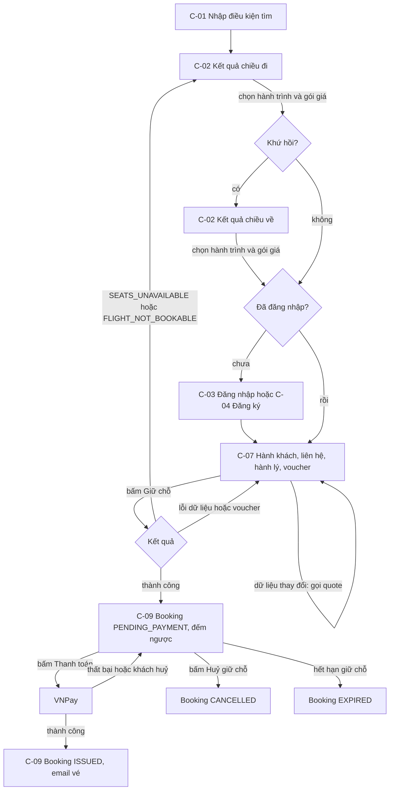

Các tình huống khác:
- **Khách đóng trình duyệt khi đang ở trang VNPay.** Booking vẫn chờ thanh toán. Khách vào C-08, mở C-09 và thanh toán tiếp, miễn là còn trong thời hạn giữ chỗ.
- **Khách đã trả tiền nhưng không quay về trang của hệ thống.** IPN vẫn cập nhật booking sang `ISSUED` và email vé vẫn được gửi.
- **Khách trả tiền khi booking vừa hết hạn.** Hệ thống tự tạo yêu cầu hoàn 100% (BR-44). Khách thấy yêu cầu hoàn này trong C-09.

### UF-02 Hoàn vé

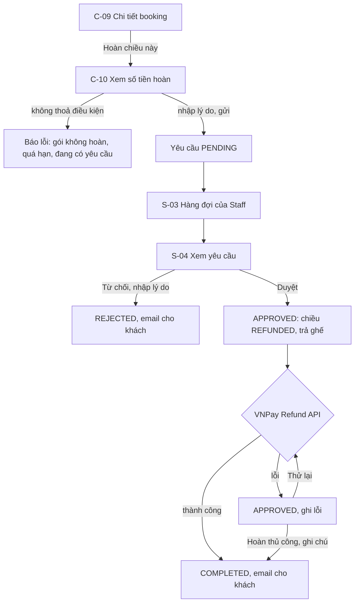

### UF-03 Đổi chuyến

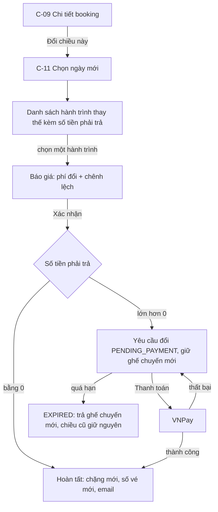

### UF-04 Admin chuẩn bị dữ liệu và mở bán

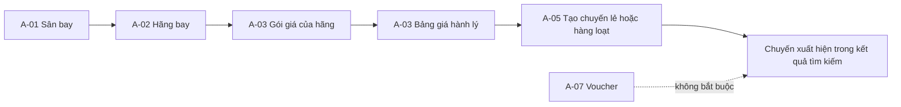

Phải làm theo đúng thứ tự trên vì dữ liệu sau tham chiếu dữ liệu trước:
- Chuyến bay cần sân bay và hãng.
- Giá bán của chuyến cần gói giá của hãng.
- Hành lý mua thêm cần bảng giá hành lý của hãng.

### UF-05 Sự cố chuyến bay

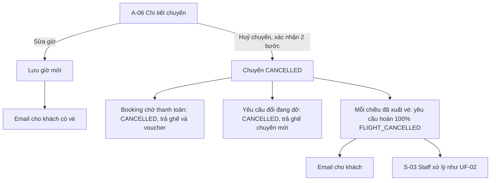

### UF-06 Quên mật khẩu

1. Ở C-05, người dùng nhập email. Hệ thống luôn báo "đã gửi email nếu tài khoản tồn tại".
2. Nếu email tồn tại, hệ thống gửi link `/reset-password?token=...`, sống 30 phút và chỉ dùng được một lần.
3. Ở C-06, người dùng nhập mật khẩu mới. Thành công thì mở C-03. Token không hợp lệ thì báo `INVALID_TOKEN` và gợi ý làm lại từ bước 1.

### UF-07 Staff hỗ trợ khách

1. Ở S-01, Staff tìm booking theo mã đặt chỗ, email hoặc số điện thoại mà khách cung cấp.
2. Ở S-02, Staff xem trạng thái, vé, các lượt thu và hoàn, các yêu cầu hoàn và đổi.
3. Nếu khách không nhận được vé, Staff bấm "Gửi lại email vé".
4. Nếu chuyến bị đổi giờ hoặc huỷ, Staff mở S-06 của chuyến đó để có danh sách khách cần liên hệ.

---

## 4. Vòng đời trạng thái

### 4.1 Booking

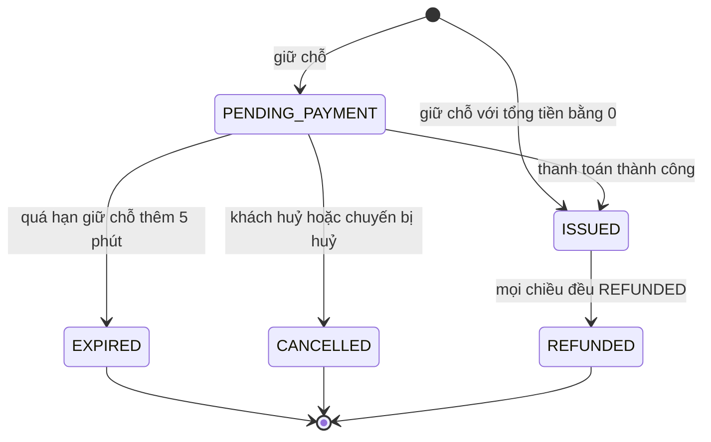

Booking khứ hồi mới hoàn một chiều thì vẫn ở `ISSUED`. Trạng thái "đã bay" không được lưu, mà suy ra từ giờ cất cánh.

### 4.2 Chiều (journey)

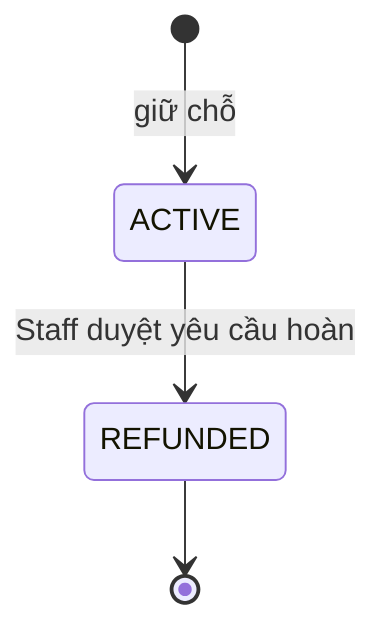

Đổi chuyến không đổi trạng thái của chiều, chỉ thay các chặng bên trong.

### 4.3 Chặng (segment) và số ghế

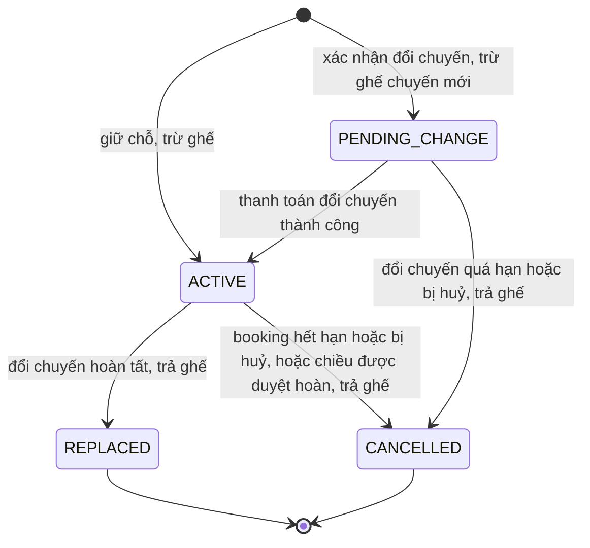

**Bất biến về ghế:** chặng ở `ACTIVE` hoặc `PENDING_CHANGE` đang giữ (số người lớn + số trẻ em) ghế trong hạng ghế của chiều. Mỗi khi chặng rời hai trạng thái này, số ghế đó phải được cộng trả lại đúng một lần.

### 4.4 Lượt thu (payment, `kind = CHARGE`)

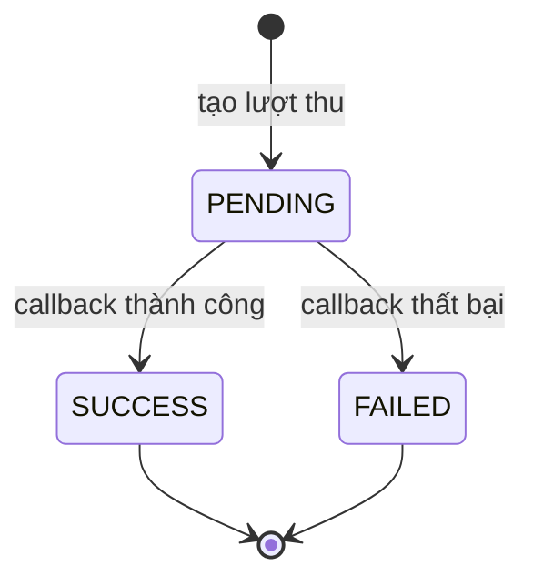

- Lượt thu ở `PENDING` mà không bao giờ có callback (khách bỏ ngang) thì cứ giữ nguyên, không gây hại gì: link VNPay đã hết hạn, và báo cáo chỉ tính các lượt `SUCCESS`.
- Lượt hoàn (`kind = REFUND`) được ghi thẳng ở trạng thái `SUCCESS` hoặc `FAILED` sau mỗi lần gọi Refund API.

### 4.5 Yêu cầu hoàn

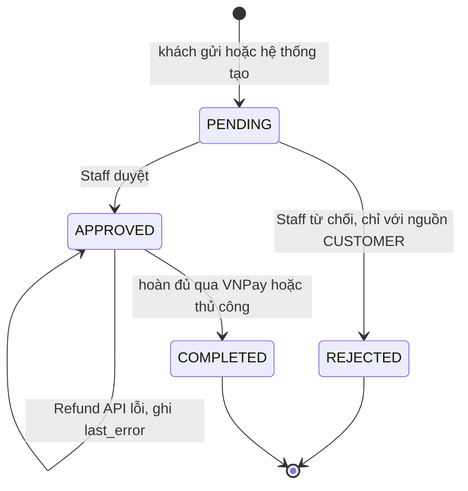

| Nguồn | Ai tạo | Phí | Chiều liên quan |
|---|---|---|---|
| `CUSTOMER` | Khách (FR-51) | Theo gói giá | Có |
| `FLIGHT_CANCELLED` | Hệ thống khi huỷ chuyến (BR-84) | 0 | Có |
| `INVALID_PAYMENT` | Hệ thống khi thanh toán trễ hoặc trùng (BR-44) | 0 | Không. Gắn với lượt thu |

### 4.6 Yêu cầu đổi chuyến

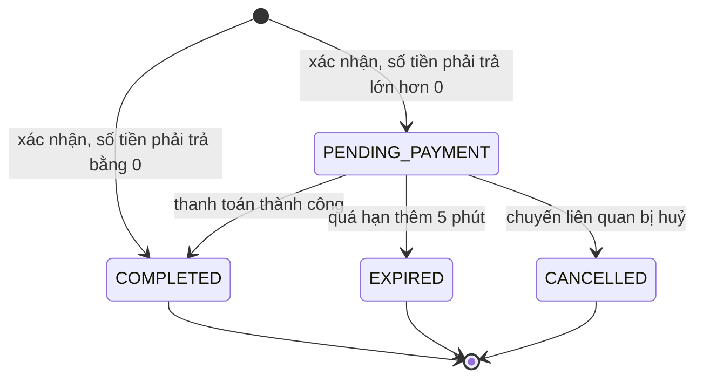

### 4.7 Chuyến bay và tài khoản

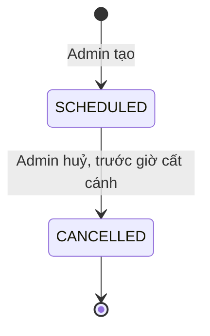

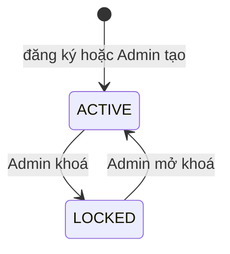

---

## 5. Sequence diagram

IPN và Return URL đều đi vào domain công khai của Next.js rồi được rewrite sang backend. Để sơ đồ gọn, các bước rewrite được lược bỏ.

### SD-01 Giữ chỗ và thanh toán

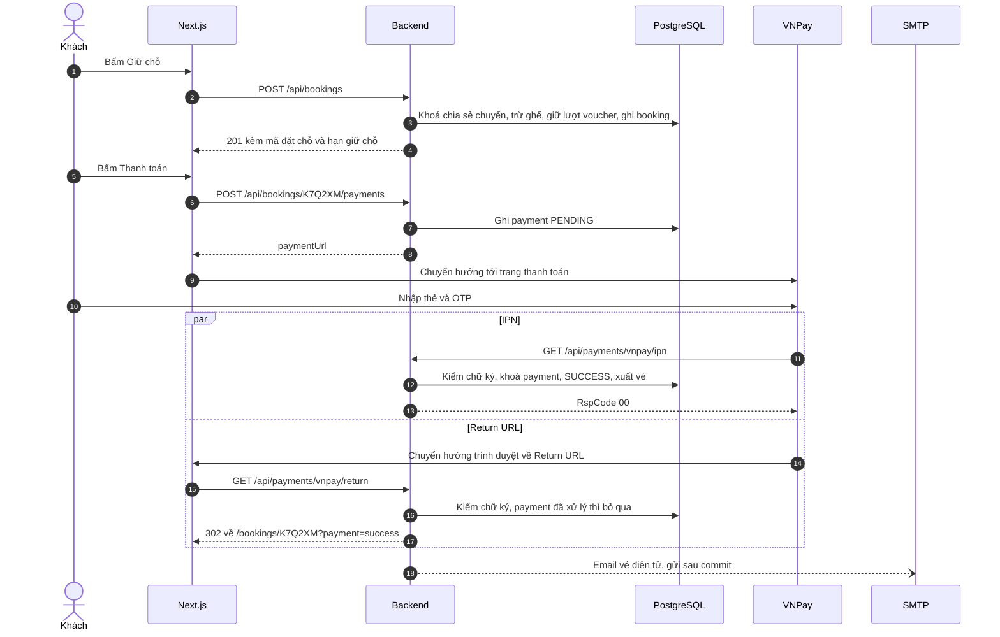

### SD-02 Hết hạn giữ chỗ

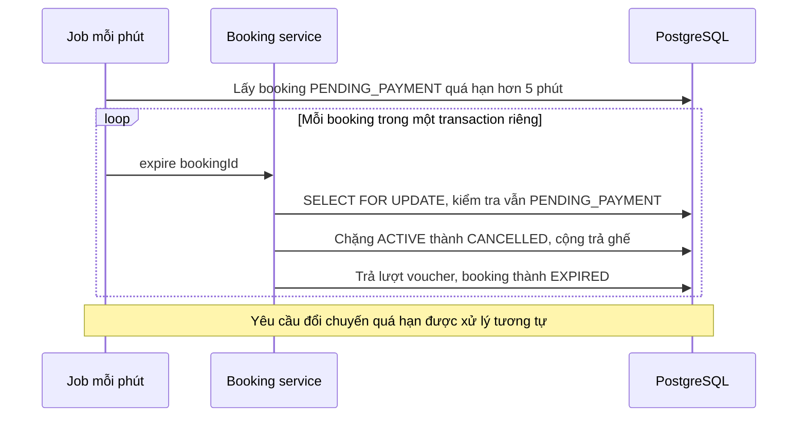

### SD-03 Hoàn vé

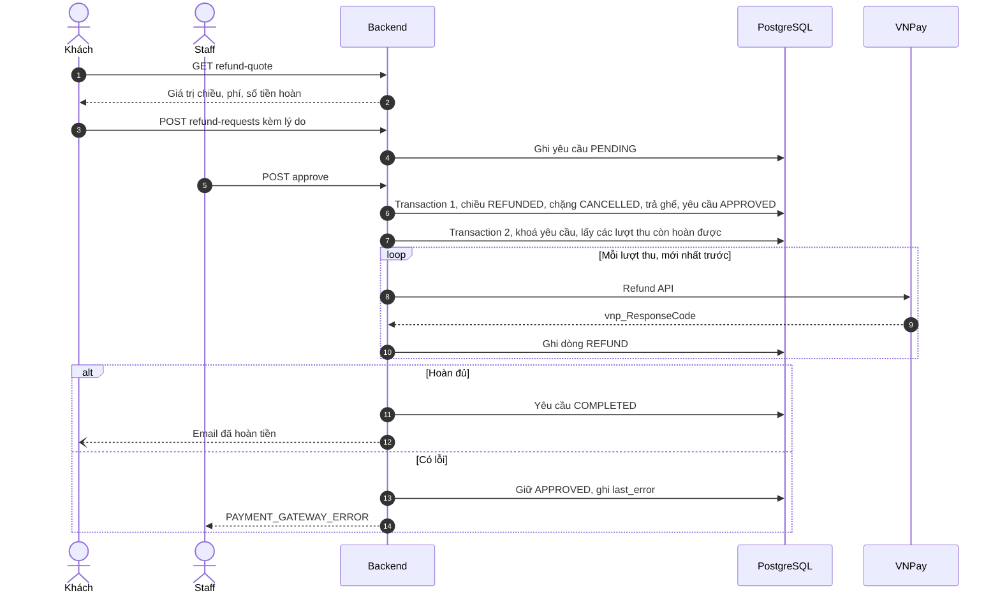

### SD-04 Đổi chuyến

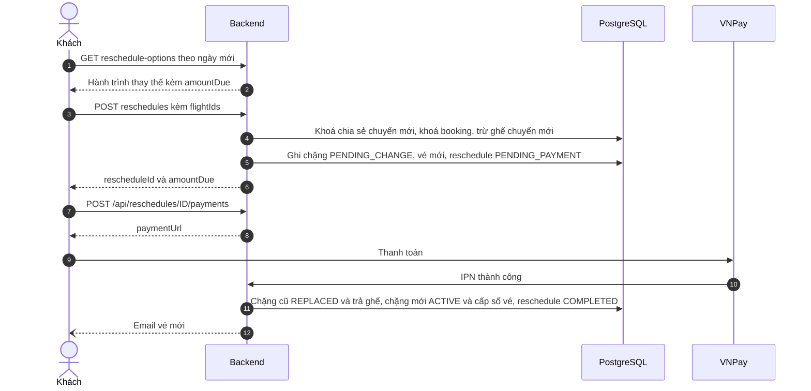

### SD-05 Huỷ chuyến bay

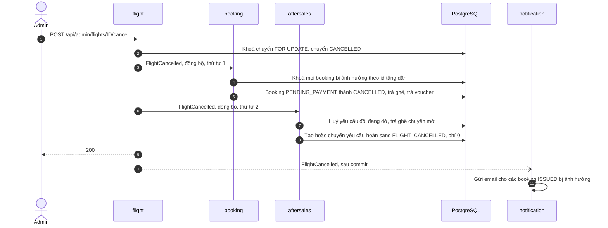
