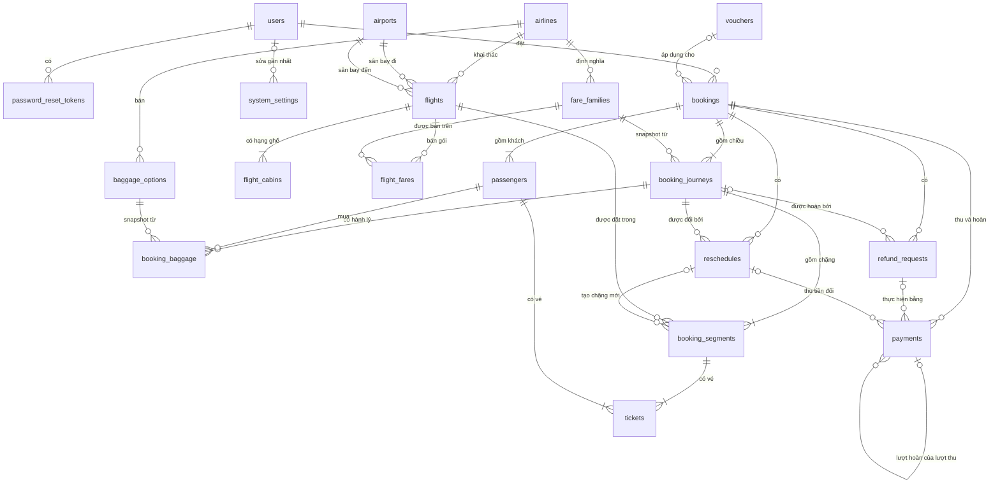

# Backend Schema — Cơ sở dữ liệu

| | |
|---|---|
| Phiên bản | 1.0 |
| Ngày | 2026-10-09 |
| CSDL | PostgreSQL 18, migration bằng Flyway |
| Tài liệu liên quan | [PRD](PRD.md) · [TDD](TDD.md) · [App Flow](APP_FLOW.md) |

DDL ở [mục 5](#5-ddl-v1__initsql) là định nghĩa gốc của schema và được dùng nguyên văn làm migration `V1__init.sql`. Các mục còn lại giải thích DDL đó.

---

## 1. Quy ước

| Hạng mục | Quy ước |
|---|---|
| Tên bảng, tên cột | `snake_case`. Tên bảng ở dạng số nhiều |
| Khoá chính | `id BIGINT GENERATED ALWAYS AS IDENTITY`. Ngoại lệ: `airports`, `airlines` dùng mã IATA làm khoá; `system_settings` dùng `key` |
| Thời điểm | `TIMESTAMPTZ`, lưu theo UTC (TDD §5.1) |
| Ngày (ngày sinh, hạn hộ chiếu) | `DATE` |
| Tiền | `BIGINT`, đơn vị đồng |
| Enum | `VARCHAR` kèm `CHECK (... IN (...))`. Java ánh xạ bằng `@Enumerated(EnumType.STRING)` (AD-09) |
| Chuỗi mã | `VARCHAR` kèm `CHECK` regex. Không dùng `CHAR(n)` để Hibernate `validate` khớp kiểu `String` |
| Bất biến nghiệp vụ | Ràng buộc ngay trong DB khi có thể: `CHECK`, `UNIQUE`, unique index có điều kiện |
| Xoá dữ liệu | Không xoá mềm. Dữ liệu danh mục dùng cờ `active`; chuyến bay dùng trạng thái `CANCELLED` |
| Migration | `db/migration/V{n}__{mô_tả}.sql`. Dữ liệu demo nằm ở `db/seed/V{100+n}__seed_{mô_tả}.sql`, chỉ nạp ở profile `dev` và `demo` |

---

## 2. Danh sách bảng

| Bảng | Module sở hữu | Mô tả |
|---|---|---|
| `users` | identity | Tài khoản, mỗi tài khoản có một vai trò |
| `password_reset_tokens` | identity | Token đặt lại mật khẩu (chỉ lưu hash) |
| `system_settings` | common | Tham số nghiệp vụ ([PRD §7](PRD.md#7-tham-số-hệ-thống)) |
| `airports` | catalog | Sân bay, có quốc gia và múi giờ |
| `airlines` | catalog | Hãng bay, có mã số vé |
| `fare_families` | catalog | Gói giá của hãng, kèm quy định hành lý và hoàn/đổi |
| `baggage_options` | catalog | Bảng giá hành lý mua thêm của hãng |
| `flights` | flight | Chuyến bay |
| `flight_cabins` | flight | Kho ghế theo hạng ghế của từng chuyến (bộ đếm ghế còn) |
| `flight_fares` | flight | Giá bán (giá người lớn) của từng gói giá trên từng chuyến |
| `vouchers` | promotion | Mã giảm giá, có bộ đếm lượt dùng |
| `bookings` | booking | Booking và tổng tiền |
| `booking_journeys` | booking | Chiều đi/về của booking, kèm snapshot gói giá và mức giảm được phân bổ |
| `booking_segments` | booking | Chặng của một chiều, trỏ tới chuyến bay |
| `passengers` | booking | Hành khách của booking |
| `tickets` | booking | Vé: 1 hành khách × 1 chặng, có giá và số vé |
| `booking_baggage` | booking | Hành lý mua thêm: 1 hành khách × 1 chiều |
| `reschedules` | aftersales | Yêu cầu đổi chuyến |
| `refund_requests` | aftersales | Yêu cầu hoàn |
| `payments` | payment | Sổ giao dịch, ghi mọi lượt thu (`CHARGE`) và lượt hoàn (`REFUND`) |

---

## 3. Sơ đồ quan hệ

Sơ đồ chỉ thể hiện quan hệ. Cột chi tiết của từng bảng xem trong DDL.



---

## 4. Giá trị enum

| Bảng.cột | Giá trị | Ghi chú |
|---|---|---|
| `users.role` | `CUSTOMER`, `STAFF`, `ADMIN` | |
| `users.status` | `ACTIVE`, `LOCKED` | |
| `*.cabin_class` | `ECONOMY`, `PREMIUM_ECONOMY`, `BUSINESS`, `FIRST` | |
| `flights.status` | `SCHEDULED`, `CANCELLED` | "Đã bay" suy ra từ giờ cất cánh, không lưu |
| `bookings.status` | `PENDING_PAYMENT`, `ISSUED`, `EXPIRED`, `CANCELLED`, `REFUNDED` | APP_FLOW §4.1 |
| `booking_journeys.direction` | `OUTBOUND`, `RETURN` | |
| `booking_journeys.status` | `ACTIVE`, `REFUNDED` | APP_FLOW §4.2 |
| `booking_segments.status` | `ACTIVE`, `PENDING_CHANGE`, `CANCELLED`, `REPLACED` | Chặng ở `ACTIVE` hoặc `PENDING_CHANGE` đang giữ ghế (APP_FLOW §4.3) |
| `passengers.type` | `ADULT`, `CHILD`, `INFANT` | |
| `passengers.gender` | `MALE`, `FEMALE` | |
| `vouchers.discount_type` | `PERCENT`, `FIXED` | |
| `payments.kind` | `CHARGE`, `REFUND` | |
| `payments.provider` | `VNPAY`, `MANUAL` | `MANUAL` chỉ dùng cho lượt hoàn thủ công |
| `payments.status` | `PENDING`, `SUCCESS`, `FAILED` | Lượt hoàn không bao giờ ở `PENDING` |
| `refund_requests.source` | `CUSTOMER`, `FLIGHT_CANCELLED`, `INVALID_PAYMENT` | APP_FLOW §4.5 |
| `refund_requests.status` | `PENDING`, `APPROVED`, `REJECTED`, `COMPLETED` | |
| `reschedules.status` | `PENDING_PAYMENT`, `COMPLETED`, `EXPIRED`, `CANCELLED` | APP_FLOW §4.6 |

---

## 5. DDL (`V1__init.sql`)

```sql
-- =====================================================================
-- V1__init.sql — Flight Booking System
-- =====================================================================

-- ------------------------------------------------------------ identity
CREATE TABLE users (
    id             BIGINT       GENERATED ALWAYS AS IDENTITY PRIMARY KEY,
    email          VARCHAR(255) NOT NULL UNIQUE CHECK (email = lower(email)),   -- BR-100: lưu chữ thường
    password_hash  VARCHAR(100) NOT NULL,                                       -- BCrypt
    full_name      VARCHAR(100) NOT NULL,
    phone          VARCHAR(20)  NOT NULL,
    role           VARCHAR(20)  NOT NULL CHECK (role IN ('CUSTOMER', 'STAFF', 'ADMIN')),
    status         VARCHAR(20)  NOT NULL DEFAULT 'ACTIVE' CHECK (status IN ('ACTIVE', 'LOCKED')),
    created_at     TIMESTAMPTZ  NOT NULL DEFAULT now(),
    updated_at     TIMESTAMPTZ  NOT NULL DEFAULT now()
);

CREATE TABLE password_reset_tokens (
    id          BIGINT      GENERATED ALWAYS AS IDENTITY PRIMARY KEY,
    user_id     BIGINT      NOT NULL REFERENCES users (id),
    token_hash  VARCHAR(64) NOT NULL UNIQUE,      -- SHA-256 (hex) của token, không lưu token gốc
    expires_at  TIMESTAMPTZ NOT NULL,
    used_at     TIMESTAMPTZ,
    created_at  TIMESTAMPTZ NOT NULL DEFAULT now()
);

-- ------------------------------------------------------------ common
CREATE TABLE system_settings (
    key          VARCHAR(100) PRIMARY KEY,
    value        VARCHAR(100) NOT NULL,
    description  VARCHAR(255) NOT NULL,
    updated_at   TIMESTAMPTZ  NOT NULL DEFAULT now(),
    updated_by   BIGINT       REFERENCES users (id)
);

INSERT INTO system_settings (key, value, description) VALUES
    ('booking.hold_minutes',                  '15',  'Thời gian giữ chỗ và hạn thanh toán đổi chuyến (phút)'),
    ('booking.min_hours_before_departure',    '3',   'Không bán chuyến cất cánh trong vòng N giờ tới'),
    ('booking.max_seated_passengers',         '9',   'Số khách chiếm ghế tối đa mỗi booking'),
    ('pricing.child_percent',                 '90',  'Giá vé trẻ em (% giá người lớn)'),
    ('pricing.infant_percent',                '10',  'Giá vé em bé (% giá người lớn)'),
    ('aftersales.min_hours_before_departure', '24',  'Hạn chót hoàn/đổi: trước giờ cất cánh N giờ'),
    ('search.min_connection_minutes',         '60',  'Thời gian nối chuyến tối thiểu (phút)'),
    ('search.max_connection_minutes',         '720', 'Thời gian nối chuyến tối đa (phút)');

-- ------------------------------------------------------------ catalog
CREATE TABLE airports (
    code          VARCHAR(3)   PRIMARY KEY CHECK (code ~ '^[A-Z]{3}$'),
    name          VARCHAR(100) NOT NULL,
    city          VARCHAR(100) NOT NULL,
    country_code  VARCHAR(2)   NOT NULL CHECK (country_code ~ '^[A-Z]{2}$'),
    timezone      VARCHAR(50)  NOT NULL,          -- IANA, VD 'Asia/Ho_Chi_Minh'
    active        BOOLEAN      NOT NULL DEFAULT TRUE
);

CREATE TABLE airlines (
    code           VARCHAR(2)   PRIMARY KEY CHECK (code ~ '^[A-Z0-9]{2}$'),
    name           VARCHAR(100) NOT NULL,
    ticket_prefix  VARCHAR(3)   NOT NULL UNIQUE CHECK (ticket_prefix ~ '^[0-9]{3}$'),   -- BR-43
    active         BOOLEAN      NOT NULL DEFAULT TRUE
);

CREATE TABLE fare_families (
    id                  BIGINT      GENERATED ALWAYS AS IDENTITY PRIMARY KEY,
    airline_code        VARCHAR(2)  NOT NULL REFERENCES airlines (code),
    cabin_class         VARCHAR(20) NOT NULL CHECK (cabin_class IN ('ECONOMY', 'PREMIUM_ECONOMY', 'BUSINESS', 'FIRST')),
    name                VARCHAR(50) NOT NULL,
    carry_on_kg         INT         NOT NULL CHECK (carry_on_kg >= 0),
    checked_baggage_kg  INT         NOT NULL CHECK (checked_baggage_kg >= 0),
    refundable          BOOLEAN     NOT NULL,
    refund_fee          BIGINT      NOT NULL DEFAULT 0 CHECK (refund_fee >= 0),   -- mỗi khách chiếm ghế, mỗi chiều
    changeable          BOOLEAN     NOT NULL,
    change_fee          BIGINT      NOT NULL DEFAULT 0 CHECK (change_fee >= 0),   -- mỗi khách chiếm ghế, mỗi chiều
    active              BOOLEAN     NOT NULL DEFAULT TRUE,
    UNIQUE (airline_code, name)                                                   -- BR-92
);

CREATE TABLE baggage_options (
    id            BIGINT     GENERATED ALWAYS AS IDENTITY PRIMARY KEY,
    airline_code  VARCHAR(2) NOT NULL REFERENCES airlines (code),
    weight_kg     INT        NOT NULL CHECK (weight_kg > 0),
    price         BIGINT     NOT NULL CHECK (price > 0),    -- mỗi hành khách, mỗi chiều (BR-22)
    active        BOOLEAN    NOT NULL DEFAULT TRUE,
    UNIQUE (airline_code, weight_kg)                        -- BR-92
);

-- ------------------------------------------------------------ flight
CREATE TABLE flights (
    id                 BIGINT      GENERATED ALWAYS AS IDENTITY PRIMARY KEY,
    airline_code       VARCHAR(2)  NOT NULL REFERENCES airlines (code),
    flight_number      VARCHAR(6)  NOT NULL CHECK (flight_number ~ '^[A-Z0-9]{2}[0-9]{1,4}$'),
    departure_airport  VARCHAR(3)  NOT NULL REFERENCES airports (code),
    arrival_airport    VARCHAR(3)  NOT NULL REFERENCES airports (code),
    departure_time     TIMESTAMPTZ NOT NULL,
    arrival_time       TIMESTAMPTZ NOT NULL,
    aircraft_model     VARCHAR(50),
    status             VARCHAR(20) NOT NULL DEFAULT 'SCHEDULED' CHECK (status IN ('SCHEDULED', 'CANCELLED')),
    created_at         TIMESTAMPTZ NOT NULL DEFAULT now(),
    updated_at         TIMESTAMPTZ NOT NULL DEFAULT now(),
    CHECK (left(flight_number, 2) = airline_code),          -- BR-80
    CHECK (departure_airport <> arrival_airport),           -- BR-81
    CHECK (arrival_time > departure_time),                  -- BR-81
    UNIQUE (airline_code, flight_number, departure_time)    -- BR-80
);
CREATE INDEX ix_flights_route_time  ON flights (departure_airport, arrival_airport, departure_time);
CREATE INDEX ix_flights_origin_time ON flights (departure_airport, departure_time);

CREATE TABLE flight_cabins (
    id               BIGINT      GENERATED ALWAYS AS IDENTITY PRIMARY KEY,
    flight_id        BIGINT      NOT NULL REFERENCES flights (id) ON DELETE CASCADE,
    cabin_class      VARCHAR(20) NOT NULL CHECK (cabin_class IN ('ECONOMY', 'PREMIUM_ECONOMY', 'BUSINESS', 'FIRST')),
    total_seats      INT         NOT NULL CHECK (total_seats > 0),
    available_seats  INT         NOT NULL,                -- chỉ đổi bằng Q-01, Q-02, Q-03
    UNIQUE (flight_id, cabin_class),
    CHECK (available_seats BETWEEN 0 AND total_seats)     -- DB chặn bán vượt ghế
);

CREATE TABLE flight_fares (
    id              BIGINT GENERATED ALWAYS AS IDENTITY PRIMARY KEY,
    flight_id       BIGINT NOT NULL REFERENCES flights (id) ON DELETE CASCADE,
    fare_family_id  BIGINT NOT NULL REFERENCES fare_families (id),
    price           BIGINT NOT NULL CHECK (price > 0),    -- giá người lớn của chặng (BR-20)
    UNIQUE (flight_id, fare_family_id)
);
CREATE INDEX ix_flight_fares_fare_family ON flight_fares (fare_family_id);

-- ------------------------------------------------------------ promotion
CREATE TABLE vouchers (
    id                BIGINT       GENERATED ALWAYS AS IDENTITY PRIMARY KEY,
    code              VARCHAR(30)  NOT NULL UNIQUE CHECK (code ~ '^[A-Z0-9]{3,30}$'),
    description       VARCHAR(255) NOT NULL,
    discount_type     VARCHAR(10)  NOT NULL CHECK (discount_type IN ('PERCENT', 'FIXED')),
    discount_value    BIGINT       NOT NULL CHECK (discount_value > 0),   -- phần trăm (1–100) hoặc số đồng
    max_discount      BIGINT       CHECK (max_discount > 0),              -- chỉ dùng cho PERCENT; NULL = không giới hạn
    min_order_amount  BIGINT       NOT NULL DEFAULT 0 CHECK (min_order_amount >= 0),
    valid_from        TIMESTAMPTZ  NOT NULL,
    valid_to          TIMESTAMPTZ  NOT NULL,
    usage_limit       INT          CHECK (usage_limit > 0),               -- NULL = không giới hạn
    used_count        INT          NOT NULL DEFAULT 0,                    -- chỉ đổi bằng Q-14, Q-15
    active            BOOLEAN      NOT NULL DEFAULT TRUE,
    created_at        TIMESTAMPTZ  NOT NULL DEFAULT now(),
    CHECK (valid_to > valid_from),
    CHECK (discount_type <> 'PERCENT' OR discount_value <= 100),
    CHECK (discount_type = 'PERCENT' OR max_discount IS NULL),
    CHECK (used_count >= 0 AND (usage_limit IS NULL OR used_count <= usage_limit))
);

-- ------------------------------------------------------------ booking
CREATE TABLE bookings (
    id               BIGINT       GENERATED ALWAYS AS IDENTITY PRIMARY KEY,
    code             VARCHAR(6)   NOT NULL UNIQUE CHECK (code ~ '^[A-HJ-NP-Z2-9]{6}$'),   -- BR-46
    user_id          BIGINT       NOT NULL REFERENCES users (id),
    status           VARCHAR(20)  NOT NULL CHECK (status IN ('PENDING_PAYMENT', 'ISSUED', 'EXPIRED', 'CANCELLED', 'REFUNDED')),
    contact_name     VARCHAR(100) NOT NULL,
    contact_email    VARCHAR(255) NOT NULL,
    contact_phone    VARCHAR(20)  NOT NULL,
    voucher_id       BIGINT       REFERENCES vouchers (id),
    fare_total       BIGINT       NOT NULL CHECK (fare_total >= 0),       -- tổng giá vé lúc giữ chỗ
    baggage_total    BIGINT       NOT NULL CHECK (baggage_total >= 0),
    discount_total   BIGINT       NOT NULL CHECK (discount_total >= 0),
    total_amount     BIGINT       NOT NULL CHECK (total_amount >= 0),
    hold_expires_at  TIMESTAMPTZ  NOT NULL,
    issued_at        TIMESTAMPTZ,
    created_at       TIMESTAMPTZ  NOT NULL DEFAULT now(),
    updated_at       TIMESTAMPTZ  NOT NULL DEFAULT now(),
    CHECK (total_amount = fare_total + baggage_total - discount_total),   -- BR-23
    CHECK (voucher_id IS NOT NULL OR discount_total = 0)
);
CREATE INDEX ix_bookings_user ON bookings (user_id, created_at DESC);
CREATE INDEX ix_bookings_hold ON bookings (hold_expires_at) WHERE status = 'PENDING_PAYMENT';
-- BR-30: mỗi tài khoản dùng một voucher tối đa một lần; booking EXPIRED/CANCELLED trả lại quyền dùng
CREATE UNIQUE INDEX uq_bookings_voucher_user ON bookings (voucher_id, user_id)
    WHERE voucher_id IS NOT NULL AND status IN ('PENDING_PAYMENT', 'ISSUED', 'REFUNDED');

CREATE TABLE booking_journeys (
    id                  BIGINT      GENERATED ALWAYS AS IDENTITY PRIMARY KEY,
    booking_id          BIGINT      NOT NULL REFERENCES bookings (id),
    direction           VARCHAR(10) NOT NULL CHECK (direction IN ('OUTBOUND', 'RETURN')),
    status              VARCHAR(10) NOT NULL DEFAULT 'ACTIVE' CHECK (status IN ('ACTIVE', 'REFUNDED')),
    airline_code        VARCHAR(2)  NOT NULL REFERENCES airlines (code),
    fare_family_id      BIGINT      NOT NULL REFERENCES fare_families (id),
    -- snapshot gói giá tại thời điểm giữ chỗ (BR-24)
    fare_family_name    VARCHAR(50) NOT NULL,
    cabin_class         VARCHAR(20) NOT NULL CHECK (cabin_class IN ('ECONOMY', 'PREMIUM_ECONOMY', 'BUSINESS', 'FIRST')),
    carry_on_kg         INT         NOT NULL,
    checked_baggage_kg  INT         NOT NULL,
    refundable          BOOLEAN     NOT NULL,
    refund_fee          BIGINT      NOT NULL,
    changeable          BOOLEAN     NOT NULL,
    change_fee          BIGINT      NOT NULL,
    discount_amount     BIGINT      NOT NULL DEFAULT 0 CHECK (discount_amount >= 0),   -- BR-33
    UNIQUE (booking_id, direction)
);

CREATE TABLE booking_segments (
    id             BIGINT      GENERATED ALWAYS AS IDENTITY PRIMARY KEY,
    journey_id     BIGINT      NOT NULL REFERENCES booking_journeys (id),
    flight_id      BIGINT      NOT NULL REFERENCES flights (id),   -- không CASCADE: chặn xoá chuyến đã có booking (BR-82)
    seq            SMALLINT    NOT NULL CHECK (seq IN (1, 2)),
    status         VARCHAR(20) NOT NULL CHECK (status IN ('ACTIVE', 'PENDING_CHANGE', 'CANCELLED', 'REPLACED')),
    adult_price    BIGINT      NOT NULL CHECK (adult_price > 0),   -- snapshot flight_fares.price
    reschedule_id  BIGINT,                                         -- yêu cầu đổi đã tạo chặng này; FK thêm ở dưới
    created_at     TIMESTAMPTZ NOT NULL DEFAULT now(),
    CHECK (status <> 'PENDING_CHANGE' OR reschedule_id IS NOT NULL)
);
CREATE INDEX ix_segments_journey ON booking_segments (journey_id);
CREATE INDEX ix_segments_flight  ON booking_segments (flight_id, status);
CREATE UNIQUE INDEX uq_segments_active_seq ON booking_segments (journey_id, seq) WHERE status = 'ACTIVE';

CREATE TABLE passengers (
    id               BIGINT      GENERATED ALWAYS AS IDENTITY PRIMARY KEY,
    booking_id       BIGINT      NOT NULL REFERENCES bookings (id),
    type             VARCHAR(10) NOT NULL CHECK (type IN ('ADULT', 'CHILD', 'INFANT')),
    last_name        VARCHAR(50) NOT NULL CHECK (last_name ~ '^[A-Z]+( [A-Z]+)*$'),    -- BR-12
    first_name       VARCHAR(50) NOT NULL CHECK (first_name ~ '^[A-Z]+( [A-Z]+)*$'),   -- BR-12
    gender           VARCHAR(10) NOT NULL CHECK (gender IN ('MALE', 'FEMALE')),
    date_of_birth    DATE        NOT NULL,
    nationality      VARCHAR(2)  CHECK (nationality ~ '^[A-Z]{2}$'),                   -- BR-13
    passport_number  VARCHAR(20) CHECK (passport_number ~ '^[A-Z0-9]{6,20}$'),         -- BR-13
    passport_expiry  DATE
);
CREATE INDEX ix_passengers_booking ON passengers (booking_id);

CREATE TABLE tickets (
    id             BIGINT      GENERATED ALWAYS AS IDENTITY PRIMARY KEY,
    segment_id     BIGINT      NOT NULL REFERENCES booking_segments (id),
    passenger_id   BIGINT      NOT NULL REFERENCES passengers (id),
    fare_amount    BIGINT      NOT NULL CHECK (fare_amount >= 0),          -- BR-21
    ticket_number  VARCHAR(13) UNIQUE CHECK (ticket_number ~ '^[0-9]{13}$'),   -- BR-43; NULL cho tới khi xuất vé
    issued_at      TIMESTAMPTZ,
    UNIQUE (segment_id, passenger_id),
    CHECK ((ticket_number IS NULL) = (issued_at IS NULL))
);
CREATE INDEX ix_tickets_passenger ON tickets (passenger_id);
CREATE INDEX ix_tickets_issued_at ON tickets (issued_at) WHERE issued_at IS NOT NULL;
CREATE SEQUENCE ticket_number_seq;

CREATE TABLE booking_baggage (
    id                 BIGINT GENERATED ALWAYS AS IDENTITY PRIMARY KEY,
    journey_id         BIGINT NOT NULL REFERENCES booking_journeys (id),
    passenger_id       BIGINT NOT NULL REFERENCES passengers (id),
    baggage_option_id  BIGINT NOT NULL REFERENCES baggage_options (id),
    weight_kg          INT    NOT NULL CHECK (weight_kg > 0),   -- snapshot
    price              BIGINT NOT NULL CHECK (price > 0),       -- snapshot
    UNIQUE (journey_id, passenger_id)                           -- BR-22: tối đa một mức mỗi khách mỗi chiều
);

-- ------------------------------------------------------------ aftersales
CREATE TABLE reschedules (
    id                BIGINT      GENERATED ALWAYS AS IDENTITY PRIMARY KEY,
    booking_id        BIGINT      NOT NULL REFERENCES bookings (id),
    journey_id        BIGINT      NOT NULL REFERENCES booking_journeys (id),
    status            VARCHAR(20) NOT NULL CHECK (status IN ('PENDING_PAYMENT', 'COMPLETED', 'EXPIRED', 'CANCELLED')),
    old_fare_total    BIGINT      NOT NULL CHECK (old_fare_total >= 0),
    new_fare_total    BIGINT      NOT NULL CHECK (new_fare_total >= 0),
    change_fee_total  BIGINT      NOT NULL CHECK (change_fee_total >= 0),
    amount_due        BIGINT      NOT NULL,
    hold_expires_at   TIMESTAMPTZ NOT NULL,
    created_at        TIMESTAMPTZ NOT NULL DEFAULT now(),
    completed_at      TIMESTAMPTZ,
    CHECK (amount_due = change_fee_total + GREATEST(new_fare_total - old_fare_total, 0))   -- BR-72
);
CREATE UNIQUE INDEX uq_reschedules_open_journey ON reschedules (journey_id) WHERE status = 'PENDING_PAYMENT';
CREATE INDEX ix_reschedules_hold    ON reschedules (hold_expires_at) WHERE status = 'PENDING_PAYMENT';
CREATE INDEX ix_reschedules_booking ON reschedules (booking_id);

ALTER TABLE booking_segments
    ADD CONSTRAINT fk_segments_reschedule FOREIGN KEY (reschedule_id) REFERENCES reschedules (id);

CREATE TABLE refund_requests (
    id             BIGINT      GENERATED ALWAYS AS IDENTITY PRIMARY KEY,
    booking_id     BIGINT      NOT NULL REFERENCES bookings (id),
    journey_id     BIGINT      REFERENCES booking_journeys (id),    -- NULL khi source = INVALID_PAYMENT
    payment_id     BIGINT,                                          -- lượt thu cần hoàn khi source = INVALID_PAYMENT; FK thêm ở dưới
    source         VARCHAR(20) NOT NULL CHECK (source IN ('CUSTOMER', 'FLIGHT_CANCELLED', 'INVALID_PAYMENT')),
    status         VARCHAR(20) NOT NULL CHECK (status IN ('PENDING', 'APPROVED', 'REJECTED', 'COMPLETED')),
    base_amount    BIGINT      NOT NULL CHECK (base_amount >= 0),   -- giá trị chiều (BR-52) hoặc phần chưa hoàn của lượt thu
    fee_amount     BIGINT      NOT NULL CHECK (fee_amount >= 0),
    refund_amount  BIGINT      NOT NULL,
    reason         VARCHAR(500),                                    -- lý do của khách
    staff_note     VARCHAR(500),                                    -- ghi chú duyệt, lý do từ chối, ghi chú hoàn thủ công
    last_error     VARCHAR(500),                                    -- lỗi gần nhất khi gọi Refund API
    requested_by   BIGINT      REFERENCES users (id),               -- NULL khi hệ thống tạo
    processed_by   BIGINT      REFERENCES users (id),
    processed_at   TIMESTAMPTZ,
    completed_at   TIMESTAMPTZ,
    created_at     TIMESTAMPTZ NOT NULL DEFAULT now(),
    CHECK (refund_amount = GREATEST(base_amount - fee_amount, 0)),   -- BR-61
    CHECK ((source = 'INVALID_PAYMENT') = (journey_id IS NULL)),
    CHECK ((source = 'INVALID_PAYMENT') = (payment_id IS NOT NULL)),
    CHECK (source = 'CUSTOMER' OR fee_amount = 0),                   -- BR-66
    CHECK (source = 'CUSTOMER' OR status <> 'REJECTED')              -- BR-66
);
CREATE UNIQUE INDEX uq_refund_open_journey ON refund_requests (journey_id) WHERE status IN ('PENDING', 'APPROVED');
CREATE INDEX ix_refund_status  ON refund_requests (status, created_at);
CREATE INDEX ix_refund_booking ON refund_requests (booking_id);

-- ------------------------------------------------------------ payment
CREATE TABLE payments (
    id                   BIGINT      GENERATED ALWAYS AS IDENTITY PRIMARY KEY,
    booking_id           BIGINT      NOT NULL REFERENCES bookings (id),
    kind                 VARCHAR(10) NOT NULL CHECK (kind IN ('CHARGE', 'REFUND')),
    provider             VARCHAR(10) NOT NULL CHECK (provider IN ('VNPAY', 'MANUAL')),
    status               VARCHAR(10) NOT NULL CHECK (status IN ('PENDING', 'SUCCESS', 'FAILED')),
    amount               BIGINT      NOT NULL CHECK (amount > 0),
    reschedule_id        BIGINT      REFERENCES reschedules (id),      -- lượt thu của đổi chuyến
    refund_request_id    BIGINT      REFERENCES refund_requests (id),  -- lượt hoàn: thuộc yêu cầu hoàn nào
    original_payment_id  BIGINT      REFERENCES payments (id),         -- lượt hoàn: hoàn vào lượt thu nào
    txn_ref              VARCHAR(40) NOT NULL UNIQUE,   -- vnp_TxnRef (lượt thu) hoặc vnp_RequestId (lượt hoàn); UUID không gạch nối
    provider_txn_no      VARCHAR(30),                   -- vnp_TransactionNo
    provider_txn_date    VARCHAR(14),                   -- vnp_PayDate (yyyyMMddHHmmss, GMT+7), cần khi gọi Refund API
    response_code        VARCHAR(10),                   -- vnp_ResponseCode
    raw_response         JSONB,                         -- toàn bộ tham số/phản hồi từ VNPay, để đối soát
    expires_at           TIMESTAMPTZ,                   -- lượt thu: hạn của link thanh toán
    created_at           TIMESTAMPTZ NOT NULL DEFAULT now(),
    completed_at         TIMESTAMPTZ,                   -- thời điểm chuyển SUCCESS/FAILED; dùng cho báo cáo dòng tiền
    CHECK ((kind = 'REFUND') = (original_payment_id IS NOT NULL)),
    CHECK ((kind = 'REFUND') = (refund_request_id IS NOT NULL)),
    CHECK (kind = 'CHARGE' OR reschedule_id IS NULL),
    CHECK (provider = 'VNPAY' OR kind = 'REFUND'),
    CHECK (kind = 'CHARGE' OR status <> 'PENDING'),
    CHECK ((status = 'PENDING') = (completed_at IS NULL))
);
CREATE INDEX ix_payments_booking        ON payments (booking_id);
CREATE INDEX ix_payments_original       ON payments (original_payment_id) WHERE original_payment_id IS NOT NULL;
CREATE INDEX ix_payments_refund_request ON payments (refund_request_id) WHERE refund_request_id IS NOT NULL;
CREATE INDEX ix_payments_completed      ON payments (completed_at) WHERE status = 'SUCCESS';

ALTER TABLE refund_requests
    ADD CONSTRAINT fk_refund_requests_payment FOREIGN KEY (payment_id) REFERENCES payments (id);
```

---

## 6. Ràng buộc và index quan trọng

### 6.1 Bất biến được DB bảo vệ

| Bất biến | Cách DB bảo vệ |
|---|---|
| Không bán vượt ghế (NFR-02) | `flight_cabins`: `CHECK (available_seats BETWEEN 0 AND total_seats)`, cộng với việc chỉ cập nhật bằng `UPDATE` có điều kiện (Q-01) |
| Không xoá chuyến đã có booking (BR-82) | FK `booking_segments.flight_id` không có `CASCADE`. Chuyến chưa có booking thì xoá kéo theo `flight_cabins` và `flight_fares` (`ON DELETE CASCADE`) |
| Mỗi chiều có tối đa một yêu cầu hoàn đang mở (BR-51) | Unique index có điều kiện `uq_refund_open_journey` |
| Mỗi chiều có tối đa một yêu cầu đổi đang chờ thanh toán (BR-51) | Unique index có điều kiện `uq_reschedules_open_journey` |
| Mỗi vị trí chặng trong một chiều chỉ có một chặng đang hiệu lực | Unique index có điều kiện `uq_segments_active_seq` |
| Mỗi tài khoản dùng một voucher một lần (BR-30) | Unique index có điều kiện `uq_bookings_voucher_user`. Hai request đồng thời thì request sau vi phạm unique |
| Không vượt lượt voucher | `CHECK (used_count <= usage_limit)`, cộng với `UPDATE` có điều kiện (Q-14) |
| Số vé và mã đặt chỗ duy nhất | `UNIQUE` trên `tickets.ticket_number` và `bookings.code` |
| Mỗi kết quả VNPay được ghi nhận một lần | `payments.txn_ref UNIQUE`, cộng với khoá dòng và kiểm tra `status = 'PENDING'` (TDD §6.3) |
| Tổng tiền khớp các thành phần | `CHECK` trên `bookings` (BR-23), `reschedules` (BR-72), `refund_requests` (BR-61) |
| Yêu cầu hoàn do hệ thống tạo luôn có phí 0 và không bị từ chối (BR-66) | Hai `CHECK` trên `refund_requests` |

### 6.2 Index phục vụ truy vấn

| Index | Phục vụ |
|---|---|
| `ix_flights_route_time` | Tìm chuyến bay thẳng (Q-04), tìm chặng 2 khi nối chuyến (Q-05) |
| `ix_flights_origin_time` | Tìm chặng 1 khi nối chuyến (Q-05) |
| `ix_bookings_user` | Danh sách booking của tôi (FR-40) |
| `ix_bookings_hold`, `ix_reschedules_hold` | Job hết hạn (Q-07). Là index có điều kiện nên chỉ chứa các dòng đang chờ thanh toán |
| `ix_segments_flight` | Booking bị ảnh hưởng khi huỷ hoặc đổi giờ chuyến (Q-16), manifest (Q-17) |
| `ix_payments_original` | Tính phần chưa hoàn của từng lượt thu (Q-09) |
| `ix_payments_completed` | Báo cáo dòng tiền (Q-10) |
| `ix_tickets_issued_at` | Báo cáo doanh số vé (Q-11) |
| `ix_refund_status` | Hàng đợi yêu cầu hoàn của Staff (FR-71) |

Tra cứu booking theo email hoặc số điện thoại (FR-70) quét tuần tự. Với dữ liệu cỡ đồ án thì chấp nhận được; khi cần nhanh hơn thì thêm index trên `lower(contact_email)` và `contact_phone`.

---

## 7. Truy vấn then chốt

Tham số viết dạng `:tenThamSo`. Trong Java, chạy các truy vấn này bằng `JdbcClient`, hoặc `@Query(nativeQuery = true)`.

### Q-01 Giữ ghế

```sql
UPDATE flight_cabins
SET available_seats = available_seats - :seats
WHERE flight_id = :flightId
  AND cabin_class = :cabinClass
  AND available_seats >= :seats;
-- 0 dòng bị ảnh hưởng → SEATS_UNAVAILABLE. Gọi theo thứ tự flight_id tăng dần (TDD §5.4).
```

### Q-02 Trả ghế

```sql
UPDATE flight_cabins
SET available_seats = available_seats + :seats
WHERE flight_id = :flightId
  AND cabin_class = :cabinClass;
```

### Q-03 Đổi tổng số ghế của một hạng

```sql
UPDATE flight_cabins
SET available_seats = available_seats + (:newTotal - total_seats),
    total_seats     = :newTotal
WHERE flight_id = :flightId
  AND cabin_class = :cabinClass
  AND available_seats + (:newTotal - total_seats) >= 0;
-- 0 dòng → SEAT_COUNT_BELOW_SOLD (BR-82). Biểu thức bên phải luôn đọc giá trị cũ của dòng.
```

### Q-04 Tìm chuyến bay thẳng

```sql
SELECT f.id, f.airline_code, f.flight_number, f.departure_airport, f.arrival_airport,
       f.departure_time, f.arrival_time, f.aircraft_model, c.available_seats
FROM flights f
JOIN flight_cabins c ON c.flight_id = f.id AND c.cabin_class = :cabinClass
WHERE f.departure_airport = :origin
  AND f.arrival_airport = :destination
  AND f.departure_time >= :dayStart AND f.departure_time < :dayEnd   -- ngày theo giờ sân bay đi
  AND f.departure_time >= :minDeparture                              -- BR-01
  AND f.status = 'SCHEDULED'
  AND c.available_seats >= :seats;                                   -- BR-06
```

### Q-05 Tìm nối chuyến

```sql
SELECT f1.id AS first_flight_id,
       f2.id AS second_flight_id,
       LEAST(c1.available_seats, c2.available_seats) AS seats_left
FROM flights f1
JOIN flight_cabins c1 ON c1.flight_id = f1.id AND c1.cabin_class = :cabinClass
JOIN flights f2       ON f2.departure_airport = f1.arrival_airport
                     AND f2.airline_code = f1.airline_code            -- BR-03: cùng hãng
                     AND f2.arrival_airport = :destination
                     AND f2.status = 'SCHEDULED'
                     AND f2.departure_time BETWEEN f1.arrival_time + :minConnectionMinutes * INTERVAL '1 minute'
                                               AND f1.arrival_time + :maxConnectionMinutes * INTERVAL '1 minute'
JOIN flight_cabins c2 ON c2.flight_id = f2.id AND c2.cabin_class = :cabinClass
WHERE f1.departure_airport = :origin
  AND f1.arrival_airport <> :destination
  AND f1.departure_time >= :dayStart AND f1.departure_time < :dayEnd
  AND f1.departure_time >= :minDeparture
  AND f1.status = 'SCHEDULED'
  AND c1.available_seats >= :seats
  AND c2.available_seats >= :seats;
```

### Q-06 Gói giá đang bán của các chuyến

```sql
SELECT ff.flight_id, ff.price,
       fam.id AS fare_family_id, fam.name, fam.carry_on_kg, fam.checked_baggage_kg,
       fam.refundable, fam.refund_fee, fam.changeable, fam.change_fee
FROM flight_fares ff
JOIN fare_families fam ON fam.id = ff.fare_family_id
WHERE ff.flight_id IN (:flightIds)
  AND fam.cabin_class = :cabinClass
  AND fam.active;
-- Ở Java: giữ các gói có mặt trên mọi chặng của hành trình (TDD §6.1).
```

### Q-07 Booking quá hạn giữ chỗ

```sql
SELECT id
FROM bookings
WHERE status = 'PENDING_PAYMENT'
  AND hold_expires_at < now() - INTERVAL '5 minutes'   -- BR-45
ORDER BY hold_expires_at
LIMIT 100;
-- Yêu cầu đổi chuyến quá hạn: cùng mẫu trên bảng reschedules (BR-75).
```

### Q-08 Giá trị chiều

```sql
SELECT GREATEST(
           COALESCE((SELECT SUM(t.fare_amount)
                     FROM tickets t
                     JOIN booking_segments s ON s.id = t.segment_id
                     WHERE s.journey_id = j.id AND s.status = 'ACTIVE'), 0)
         + COALESCE((SELECT SUM(b.price) FROM booking_baggage b WHERE b.journey_id = j.id), 0)
         - j.discount_amount,
         0) AS journey_value                                             -- BR-52
FROM booking_journeys j
WHERE j.id = :journeyId;
```

### Q-09 Lượt thu còn hoàn được

```sql
SELECT c.id, c.txn_ref, c.provider_txn_no, c.provider_txn_date,
       c.amount - COALESCE(SUM(r.amount) FILTER (WHERE r.status = 'SUCCESS'), 0) AS refundable
FROM payments c
LEFT JOIN payments r ON r.original_payment_id = c.id
WHERE c.booking_id = :bookingId
  AND c.kind = 'CHARGE'
  AND c.status = 'SUCCESS'
GROUP BY c.id
HAVING c.amount - COALESCE(SUM(r.amount) FILTER (WHERE r.status = 'SUCCESS'), 0) > 0
ORDER BY c.completed_at DESC;                                            -- BR-62: mới nhất trước
-- Nguồn INVALID_PAYMENT: thêm điều kiện c.id = :paymentId.
```

### Q-10 Báo cáo dòng tiền

```sql
SELECT date_trunc(:unit, completed_at AT TIME ZONE 'Asia/Ho_Chi_Minh')::date AS period,
       COALESCE(SUM(amount) FILTER (WHERE kind = 'CHARGE'), 0)            AS charged,
       COALESCE(SUM(amount) FILTER (WHERE kind = 'REFUND'), 0)            AS refunded,
       SUM(CASE WHEN kind = 'CHARGE' THEN amount ELSE -amount END)        AS net
FROM payments
WHERE status = 'SUCCESS'
  AND completed_at >= :from AND completed_at < :to
GROUP BY period
ORDER BY period;
-- :unit là 'day', 'month' hoặc 'year' (BR-110).
```

### Q-11 Doanh số vé

```sql
SELECT f.airline_code AS group_key,
       COUNT(*)           AS tickets,
       SUM(t.fare_amount) AS revenue
FROM tickets t
JOIN booking_segments s ON s.id = t.segment_id AND s.status = 'ACTIVE'
JOIN flights f          ON f.id = s.flight_id
WHERE t.issued_at >= :from AND t.issued_at < :to
GROUP BY f.airline_code
ORDER BY revenue DESC;
-- Theo tuyến (BR-111): thay f.airline_code bằng f.departure_airport || '-' || f.arrival_airport.
```

### Q-12 Tỉ lệ lấp đầy

```sql
SELECT f.id, f.flight_number, f.departure_time,
       SUM(c.total_seats)                     AS total_seats,
       SUM(c.total_seats - c.available_seats) AS occupied_seats,
       ROUND(100.0 * SUM(c.total_seats - c.available_seats) / SUM(c.total_seats), 1) AS load_factor_percent
FROM flights f
JOIN flight_cabins c ON c.flight_id = f.id
WHERE f.status = 'SCHEDULED'
  AND f.departure_time >= :from AND f.departure_time < :to
  AND (CAST(:airline AS VARCHAR) IS NULL OR f.airline_code = :airline)
GROUP BY f.id
ORDER BY f.departure_time;
```

### Q-13 Cấp số vé điện tử

```sql
SELECT a.ticket_prefix || lpad(nextval('ticket_number_seq')::text, 10, '0') AS ticket_number
FROM airlines a
WHERE a.code = :airlineCode;
-- BR-43: 3 chữ số mã hãng + 10 chữ số tăng dần toàn hệ thống.
```

### Q-14 Giữ lượt voucher

```sql
UPDATE vouchers
SET used_count = used_count + 1
WHERE id = :voucherId
  AND (usage_limit IS NULL OR used_count < usage_limit);
-- 0 dòng → VOUCHER_INVALID với lý do EXHAUSTED.
```

### Q-15 Trả lượt voucher

```sql
UPDATE vouchers
SET used_count = used_count - 1
WHERE id = :voucherId
  AND used_count > 0;
```

### Q-16 Booking bị ảnh hưởng bởi một chuyến

```sql
SELECT DISTINCT b.id AS booking_id, b.status AS booking_status,
       j.id AS journey_id, s.status AS segment_status, s.reschedule_id
FROM booking_segments s
JOIN booking_journeys j ON j.id = s.journey_id
JOIN bookings b         ON b.id = j.booking_id
WHERE s.flight_id = :flightId
  AND s.status IN ('ACTIVE', 'PENDING_CHANGE')
ORDER BY b.id;
-- Dùng khi huỷ chuyến (BR-84) và khi gửi email đổi giờ (BR-83). Khoá booking theo thứ tự này.
```

### Q-17 Danh sách hành khách của chuyến (manifest)

```sql
SELECT b.code AS booking_code, p.last_name, p.first_name, p.type,
       t.ticket_number, j.cabin_class, b.contact_phone, b.contact_email
FROM booking_segments s
JOIN booking_journeys j ON j.id = s.journey_id
JOIN bookings b         ON b.id = j.booking_id AND b.status = 'ISSUED'
JOIN tickets t          ON t.segment_id = s.id
JOIN passengers p       ON p.id = t.passenger_id
WHERE s.flight_id = :flightId
  AND s.status = 'ACTIVE'
ORDER BY p.last_name, p.first_name;
```

---

## 8. Dữ liệu khởi tạo

Toàn bộ dữ liệu ở mục này chỉ để minh hoạ. Giá và quy định gói giá **không phải chính sách thật** của các hãng. Các migration đặt trong `db/seed/`, chỉ nạp ở profile `dev` và `demo` (TDD §6.12).

### 8.1 Sân bay (`V100__seed_airports.sql`)

Mọi sân bay Việt Nam có `country_code = 'VN'` và múi giờ `Asia/Ho_Chi_Minh`.

| Mã | Tên | Thành phố |
|---|---|---|
| HAN | Nội Bài | Hà Nội |
| SGN | Tân Sơn Nhất | TP. Hồ Chí Minh |
| DAD | Đà Nẵng | Đà Nẵng |
| CXR | Cam Ranh | Nha Trang |
| PQC | Phú Quốc | Phú Quốc |
| HPH | Cát Bi | Hải Phòng |
| VCA | Cần Thơ | Cần Thơ |
| HUI | Phú Bài | Huế |
| VII | Vinh | Vinh |
| DLI | Liên Khương | Đà Lạt |
| UIH | Phù Cát | Quy Nhơn |
| BMV | Buôn Ma Thuột | Buôn Ma Thuột |
| THD | Thọ Xuân | Thanh Hoá |
| VDO | Vân Đồn | Quảng Ninh |
| PXU | Pleiku | Pleiku |
| VCS | Côn Đảo | Côn Đảo |
| TBB | Tuy Hoà | Tuy Hoà |
| VKG | Rạch Giá | Rạch Giá |
| CAH | Cà Mau | Cà Mau |
| DIN | Điện Biên Phủ | Điện Biên Phủ |
| VDH | Đồng Hới | Đồng Hới |

Sân bay quốc tế:

| Mã | Tên | Thành phố | Quốc gia | Múi giờ |
|---|---|---|---|---|
| BKK | Suvarnabhumi | Bangkok | TH | `Asia/Bangkok` |
| SIN | Changi | Singapore | SG | `Asia/Singapore` |
| KUL | Kuala Lumpur International | Kuala Lumpur | MY | `Asia/Kuala_Lumpur` |
| ICN | Incheon | Seoul | KR | `Asia/Seoul` |
| NRT | Narita | Tokyo | JP | `Asia/Tokyo` |
| HKG | Hong Kong International | Hong Kong | HK | `Asia/Hong_Kong` |
| TPE | Taoyuan | Đài Bắc | TW | `Asia/Taipei` |
| CAN | Bạch Vân | Quảng Châu | CN | `Asia/Shanghai` |

### 8.2 Hãng bay (`V101__seed_airlines.sql`)

| Mã | Tên | Mã số vé |
|---|---|---|
| VN | Vietnam Airlines | 738 |
| VJ | Vietjet Air | 978 |
| QH | Bamboo Airways | 926 |
| SQ | Singapore Airlines | 618 |
| TG | Thai Airways | 217 |

### 8.3 Gói giá (`V102__seed_fare_families.sql`)

Cột "Hệ số" chỉ dùng khi sinh giá bán ở mục 8.6.

| Hãng | Gói | Hạng ghế | Xách tay / ký gửi (kg) | Hoàn: phí | Đổi: phí | Hệ số |
|---|---|---|---|---|---|---|
| VN | Economy Lite | ECONOMY | 10 / 0 | Không | 600.000 | 1,00 |
| VN | Economy Classic | ECONOMY | 10 / 23 | 600.000 | 300.000 | 1,45 |
| VN | Economy Flex | ECONOMY | 10 / 23 | 300.000 | 0 | 1,90 |
| VN | Business Classic | BUSINESS | 18 / 32 | 600.000 | 0 | 3,60 |
| VJ | Eco | ECONOMY | 7 / 0 | Không | 400.000 | 1,00 |
| VJ | Deluxe | ECONOMY | 7 / 20 | Không | 0 | 1,40 |
| VJ | SkyBoss | BUSINESS | 10 / 30 | 500.000 | 0 | 2,80 |
| QH | Economy Saver | ECONOMY | 7 / 0 | Không | 500.000 | 1,00 |
| QH | Economy Smart | ECONOMY | 7 / 20 | 500.000 | 300.000 | 1,45 |
| QH | Business Flex | BUSINESS | 14 / 40 | 300.000 | 0 | 3,40 |
| SQ, TG | Economy Lite | ECONOMY | 7 / 20 | Không | 800.000 | 1,00 |
| SQ, TG | Economy Standard | ECONOMY | 7 / 30 | 1.000.000 | 500.000 | 1,40 |
| SQ, TG | Business | BUSINESS | 14 / 40 | 1.000.000 | 0 | 3,50 |

### 8.4 Bảng giá hành lý và voucher (`V103`, `V104`)

**Hành lý:** mỗi hãng có 4 mức 15, 20, 25, 30 kg. Hãng nội địa có giá lần lượt 250.000, 350.000, 450.000, 550.000. Hãng quốc tế gấp đôi.

**Voucher:**

| Mã | Loại | Giá trị | Mức giảm tối đa | Đơn tối thiểu | Lượt | Hiệu lực |
|---|---|---|---|---|---|---|
| `WELCOME10` | PERCENT | 10% | 200.000 | 0 | Không giới hạn | 1 năm từ ngày seed |
| `SALE100K` | FIXED | 100.000 | — | 1.000.000 | 100 | 3 tháng từ ngày seed |

### 8.5 Tài khoản mẫu (`V105__seed_accounts.sql`)

| Email | Vai trò | Mật khẩu |
|---|---|---|
| `admin@demo.local` | ADMIN | `Demo@1234` |
| `staff@demo.local` | STAFF | `Demo@1234` |
| `customer@demo.local` | CUSTOMER | `Demo@1234` |

Migration chỉ lưu hash BCrypt của mật khẩu, sinh lúc viết migration.

### 8.6 Chuyến bay (`V106__seed_flights.sql`)

Mỗi mẫu bên dưới sinh một chuyến mỗi ngày trong 60 ngày, tính từ ngày chạy migration. Tổng cộng 20 mẫu × 60 ngày = 1.200 chuyến.

- **Ghế:** `available_seats` ban đầu bằng `total_seats`.
- **Giá bán:** mỗi gói giá của hãng có giá = giá gốc × hệ số (mục 8.3), làm tròn đến 10.000 đồng.

| Số hiệu | Tuyến | Giờ đi (địa phương) | Phút bay | Máy bay | Ghế ECONOMY / BUSINESS | Giá gốc |
|---|---|---|---|---|---|---|
| VN213 | HAN→SGN | 06:00 | 130 | Airbus A321 | 168 / 16 | 1.290.000 |
| VN220 | SGN→HAN | 17:00 | 130 | Airbus A321 | 168 / 16 | 1.290.000 |
| VN1825 | SGN→PQC | 11:00 | 60 | Airbus A321 | 168 / 16 | 790.000 |
| VN1826 | PQC→SGN | 13:30 | 60 | Airbus A321 | 168 / 16 | 790.000 |
| VN1233 | HAN→PQC | 09:00 | 130 | Airbus A321 | 168 / 16 | 1.490.000 |
| VN1232 | PQC→HAN | 16:00 | 130 | Airbus A321 | 168 / 16 | 1.490.000 |
| VN125 | HAN→DAD | 07:30 | 80 | Airbus A321 | 168 / 16 | 990.000 |
| VN136 | DAD→HAN | 18:00 | 80 | Airbus A321 | 168 / 16 | 990.000 |
| VN651 | SGN→SIN | 09:30 | 120 | Airbus A321 | 168 / 16 | 2.190.000 |
| VN652 | SIN→SGN | 14:00 | 120 | Airbus A321 | 168 / 16 | 2.190.000 |
| VN416 | HAN→ICN | 23:30 | 285 | Airbus A350-900 | 271 / 29 | 5.490.000 |
| VN417 | ICN→HAN | 10:30 | 300 | Airbus A350-900 | 271 / 29 | 5.490.000 |
| VJ123 | HAN→SGN | 08:00 | 130 | Airbus A321neo | 220 / 10 | 990.000 |
| VJ122 | SGN→HAN | 19:00 | 130 | Airbus A321neo | 220 / 10 | 990.000 |
| QH201 | HAN→SGN | 10:00 | 130 | Boeing 787-9 | 270 / 24 | 1.190.000 |
| QH202 | SGN→HAN | 15:00 | 130 | Boeing 787-9 | 270 / 24 | 1.190.000 |
| SQ176 | SGN→SIN | 13:00 | 125 | Airbus A350-900 | 253 / 40 | 2.690.000 |
| SQ175 | SIN→SGN | 10:00 | 120 | Airbus A350-900 | 253 / 40 | 2.690.000 |
| TG561 | HAN→BKK | 11:00 | 110 | Airbus A320 | 150 / 12 | 2.390.000 |
| TG560 | BKK→HAN | 08:00 | 105 | Airbus A320 | 150 / 12 | 2.390.000 |

Các mẫu này cố ý tạo sẵn những tình huống cho kịch bản demo ([PRD §9](PRD.md#9-kịch-bản-demo-và-tiêu-chí-nghiệm-thu)):

| Tình huống | Chuyến dùng |
|---|---|
| Khứ hồi HAN–SGN có 3 hãng để so sánh | VN, VJ, QH |
| Nối chuyến HAN→PQC qua SGN, nối 170 phút | VN213 + VN1825, so sánh được với chuyến thẳng VN1233 |
| Chuyến quốc tế có đổi múi giờ (SGN +07:00 → SIN +08:00) | VN651, SQ176 |
| Nối chuyến quốc tế HAN→SIN qua SGN, nối 80 phút | VN213 + VN651 |
| Chuyến qua đêm | VN416 |

Đoạn SQL dưới đây (rút gọn còn hai mẫu) cho thấy cách đổi giờ địa phương thành thời điểm tuyệt đối. Phần chèn `flight_cabins` và `flight_fares` dùng cùng bảng mẫu.

```sql
CREATE TEMP TABLE seed_templates (
    airline_code VARCHAR(2), flight_number VARCHAR(6), dep VARCHAR(3), arr VARCHAR(3),
    local_time TIME, minutes INT, aircraft VARCHAR(50), eco_seats INT, bus_seats INT, base_price BIGINT
);
INSERT INTO seed_templates VALUES
    ('VN', 'VN213',  'HAN', 'SGN', '06:00', 130, 'Airbus A321', 168, 16, 1290000),
    ('VN', 'VN1825', 'SGN', 'PQC', '11:00',  60, 'Airbus A321', 168, 16,  790000);

INSERT INTO flights (airline_code, flight_number, departure_airport, arrival_airport,
                     departure_time, arrival_time, aircraft_model)
SELECT t.airline_code, t.flight_number, t.dep, t.arr,
       (d::date + t.local_time) AT TIME ZONE a.timezone,                                    -- giờ địa phương → timestamptz
       ((d::date + t.local_time) AT TIME ZONE a.timezone) + t.minutes * INTERVAL '1 minute',
       t.aircraft
FROM seed_templates t
JOIN airports a ON a.code = t.dep
CROSS JOIN generate_series(CURRENT_DATE, CURRENT_DATE + 59, INTERVAL '1 day') AS d;
```
