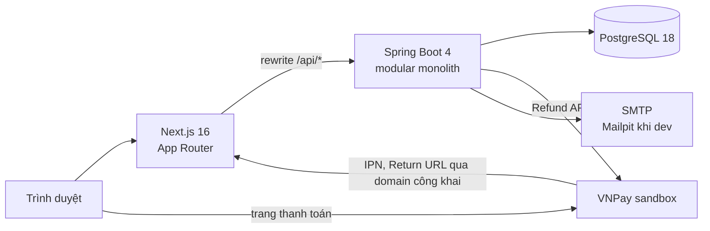

# TDD — Thiết kế kỹ thuật (Technical Design Document)

| | |
|---|---|
| Phiên bản | 1.0 |
| Ngày | 2026-10-09 |
| Tài liệu liên quan | [PRD](PRD.md) (mã `FR-xx`, `BR-xx`) · [App Flow](APP_FLOW.md) · [Backend Schema](BACKEND_SCHEMA.md) (truy vấn `Q-xx`) |

Tài liệu này mô tả hệ thống **được xây dựng như thế nào**. Mọi quy tắc nghiệp vụ được nhắc tới bằng mã `BR-xx` trong PRD, tài liệu này không định nghĩa lại.

---

## 1. Tổng quan kiến trúc



- **Một origin duy nhất.** Trình duyệt chỉ làm việc với Next.js. Next.js chuyển tiếp mọi request `/api/*` sang Spring Boot bằng `rewrites`, nên không cần CORS. Cookie phiên dùng chung được cho client component, server component và callback VNPay.
- **Server component** gọi thẳng backend qua mạng nội bộ (`BACKEND_URL`) và chuyển tiếp cookie của người dùng.
- **Backend là nguồn sự thật duy nhất** cho nghiệp vụ và phân quyền. Frontend không tự tính giá, cũng không tự kiểm tra quy tắc nghiệp vụ.

---

## 2. Công nghệ

| Thành phần | Lựa chọn | Ghi chú |
|---|---|---|
| Ngôn ngữ backend | Java 21 (LTS) | |
| Framework | Spring Boot 4.x | Dùng bản 4.x mới nhất tại thời điểm khởi tạo. Đi kèm Spring Framework 7, Spring Security 7, Hibernate 7 |
| Kiểm soát module | Spring Modulith 2.x | Kiểm tra ranh giới module, cung cấp `@ApplicationModuleListener` |
| Web | Spring Web MVC | REST/JSON, lỗi theo chuẩn `ProblemDetail` |
| Truy cập dữ liệu | Spring Data JPA cho thao tác ghi; `JdbcClient` cho truy vấn đọc phức tạp (tìm kiếm, báo cáo) | |
| Migration | Flyway | Hibernate để `ddl-auto=validate` |
| Bảo mật | Spring Security, xác thực bằng session | |
| Validation | Jakarta Bean Validation | |
| Email | Spring Mail + Thymeleaf | |
| Tài liệu API | springdoc-openapi (bản cho Spring Boot 4) | `/swagger-ui.html`, chỉ bật ở profile `dev` |
| Build | Maven Wrapper | |
| Test | JUnit 5, AssertJ, Spring Boot Test, MockMvc, `MockRestServiceServer`, Testcontainers (PostgreSQL) | |
| Cơ sở dữ liệu | PostgreSQL 18 | |
| Frontend | Next.js 16 (App Router), React, TypeScript, Tailwind CSS | |
| Runtime frontend | Node.js 24 LTS | |
| Kiểu dữ liệu API cho frontend | openapi-typescript | Sinh từ OpenAPI của backend |
| Hạ tầng dev | Docker Compose, Mailpit | |
| CI | GitHub Actions | |

Quy ước code: DTO dùng Java `record`. Entity được dùng Lombok `@Getter`/`@Setter`, nhưng không dùng `@Data` cho entity.

---

## 3. Cấu trúc mã nguồn

### 3.1 Repo

```
/
├── backend/                  # Spring Boot (Maven)
├── frontend/                 # Next.js
├── docs/                     # PRD, TDD, APP_FLOW, BACKEND_SCHEMA
├── docker-compose.yml
├── .env.example              # mẫu biến môi trường (file .env thật không commit)
└── .github/workflows/ci.yml
```

### 3.2 Module backend

Gói gốc là `vn.edu.uit.flightbooking`, mỗi module là một gói con trực tiếp. Quy ước theo Spring Modulith:

- Các lớp nằm ở **gói gốc của module** (VD `booking.BookingApi`, `booking.BookingIssued`) là API công khai, module khác được dùng.
- Các gói con là nội bộ của module:
  - `web`: controller, DTO request và response;
  - `domain`: entity, enum, logic nghiệp vụ, service;
  - `infra`: repository, client gọi dịch vụ ngoài.
- Test `ApplicationModules.of(FlightBookingApplication.class).verify()` chạy trong CI. Test này chặn phụ thuộc vòng và chặn việc truy cập gói nội bộ của module khác.
- Module này tham chiếu dữ liệu của module khác **qua ID**, không dùng quan hệ JPA xuyên module. Khoá ngoại vẫn được khai báo ở DB.
- `common` được khai báo là module mở (`@ApplicationModule(type = Type.OPEN)` trong `package-info.java`) vì mọi module đều dùng.

```
vn.edu.uit.flightbooking
├── FlightBookingApplication.java
├── common/        # lỗi & ProblemDetail, cấu hình bảo mật, tham số hệ thống, tiện ích tiền/thời gian
├── identity/      # tài khoản, đăng nhập, đặt lại mật khẩu, quản lý tài khoản
├── catalog/       # sân bay, hãng, gói giá, bảng giá hành lý
├── flight/        # chuyến bay, hạng ghế, giá bán, kho ghế, tìm kiếm, kiểm tra hành trình, manifest
├── promotion/     # voucher
├── booking/       # báo giá, giữ chỗ, hành khách, vé, xuất vé, hết hạn, tra cứu booking
├── payment/       # VNPay (tạo URL, IPN, Return URL, Refund API), sổ giao dịch
├── aftersales/    # yêu cầu hoàn, đổi chuyến, xử lý chuyến bị huỷ
├── report/        # báo cáo (chỉ đọc)
└── notification/  # email
```

| Module | Bảng sở hữu (chỉ module này được ghi) | API công khai chính | Phụ thuộc |
|---|---|---|---|
| `common` | `system_settings` | `SettingsApi`, `BusinessException`, `ErrorCode`, `Money`, `CurrentUser` | — |
| `identity` | `users`, `password_reset_tokens` | `UserApi` (tra cứu thông tin tóm tắt của user) | common |
| `catalog` | `airports`, `airlines`, `fare_families`, `baggage_options` | `CatalogApi` | common |
| `flight` | `flights`, `flight_cabins`, `flight_fares` | `FlightApi` (đọc chuyến, kiểm tra và định giá hành trình), `SeatInventory` (giữ/trả ghế), `FlightSearch` | common, catalog |
| `promotion` | `vouchers` | `VoucherApi` (kiểm tra, giữ lượt, trả lượt) | common |
| `booking` | `bookings`, `booking_journeys`, `booking_segments`, `passengers`, `tickets`, `booking_baggage` | `BookingApi` (đọc, khoá, và các thao tác trên chiều/chặng mà hậu mãi cần) | common, catalog, flight, promotion, payment |
| `payment` | `payments` | `PaymentApi` (tạo lượt thu, hoàn tiền, liệt kê lượt thu còn hoàn được) | common |
| `aftersales` | `refund_requests`, `reschedules` | `AftersalesApi` (đọc, phục vụ notification) | common, flight, booking, payment |
| `report` | — (đọc mọi bảng bằng SQL) | — | common |
| `notification` | — | — | common, identity, flight, booking, aftersales |

`payment` không phụ thuộc `booking`. Kết quả thanh toán được báo về qua sự kiện (§3.3).

### 3.3 Sự kiện giữa các module

| Sự kiện | Phát bởi | Listener đồng bộ (cùng transaction) | Listener bất đồng bộ (sau commit) |
|---|---|---|---|
| `PaymentSucceeded(paymentId, bookingId, rescheduleId, amount)` | payment | booking (lượt thu của booking), aftersales (lượt thu của đổi chuyến) | — |
| `UnexpectedPaymentReceived(paymentId, bookingId)` | booking | aftersales: tạo yêu cầu hoàn `INVALID_PAYMENT` | — |
| `BookingIssued(bookingId)` | booking | — | notification |
| `RescheduleCompleted(rescheduleId)` | aftersales | — | notification |
| `RefundRejected(refundRequestId)` | aftersales | — | notification |
| `RefundCompleted(refundRequestId)` | aftersales | — | notification |
| `FlightTimeChanged(flightId)` | flight | — | notification |
| `FlightCancelled(flightId)` | flight | booking (`@Order(1)`), aftersales (`@Order(2)`) | notification |
| `PasswordResetRequested(userId, rawToken)` | identity | — | notification |

- Hệ quả nghiệp vụ dùng `@EventListener` đồng bộ: listener chạy trong transaction của bên phát, lỗi ở listener làm rollback toàn bộ.
- Email dùng `@ApplicationModuleListener`: chạy bất đồng bộ, sau khi commit, trong transaction riêng (cần bật `@EnableAsync`).

### 3.4 Gợi ý chia việc

| Nhóm | Phụ trách | Cần có trước |
|---|---|---|
| A | common, identity, notification (khung gửi email + template) | — |
| B | catalog, flight (phần quản trị chuyến bay, kho ghế) | common |
| C | flight (tìm kiếm), booking | B |
| D | payment, aftersales | C |
| E | promotion, report, khung frontend (rewrites, `apiFetch`, `proxy.ts`, sinh kiểu API) | common |

Mỗi nhóm viết API và test cho module mình phụ trách. Màn hình frontend làm sau khi có thiết kế UI.

---

## 4. Xác thực và phân quyền

### 4.1 Phiên đăng nhập

- `POST /api/auth/login` thực hiện 3 bước:
  1. Xác thực bằng `AuthenticationManager` (`DaoAuthenticationProvider` + BCrypt).
  2. Đổi session id để chống session fixation.
  3. Lưu `SecurityContext` vào `HttpSession` qua `HttpSessionSecurityContextRepository`.
- Cookie `JSESSIONID` đặt `HttpOnly`, `SameSite=Lax`, và `Secure` khi chạy HTTPS. Phiên hết hạn sau 30 phút không hoạt động (`server.servlet.session.timeout=30m`).
- Phiên lưu trong bộ nhớ của backend. Khởi động lại backend thì mọi người phải đăng nhập lại. Điều này chấp nhận được vì chỉ chạy một instance.
- `POST /api/auth/logout` huỷ session.
- **Tài khoản bị khoá:** một filter đặt sau bước xác thực đọc trạng thái user theo ID ở mỗi request (tra theo khoá chính). Nếu `LOCKED` thì huỷ session và trả 401 `ACCOUNT_LOCKED` (BR-102).

### 4.2 CSRF

- Bật CSRF của Spring Security với `CookieCsrfTokenRepository`, đặt cookie `XSRF-TOKEN` để JavaScript đọc được. Cấu hình theo mục *Single-Page Applications* trong tài liệu Spring Security.
- Frontend gửi header `X-XSRF-TOKEN` kèm mọi request `POST`, `PUT`, `PATCH`, `DELETE`.
- `GET /api/auth/csrf` trả token và đặt cookie. Frontend gọi API này khi khởi động, sau khi đăng nhập và sau khi đăng xuất.
- Callback của VNPay là `GET`, nên không cần miễn trừ CSRF.

### 4.3 Phân quyền theo đường dẫn

| Đường dẫn | Quyền |
|---|---|
| `GET /api/flights/search`, `GET /api/airports`, `GET /api/airlines/**` | Công khai |
| `/api/auth/**` | Công khai, riêng `logout` cần đăng nhập |
| `/api/payments/vnpay/**` | Công khai, được bảo vệ bằng chữ ký |
| `/api/me/**` | Đã đăng nhập |
| `/api/bookings/**`, `/api/reschedules/**` | `CUSTOMER`; service kiểm tra thêm quyền sở hữu |
| `/api/staff/**` | `STAFF`. ADMIN kế thừa qua `RoleHierarchy` (`ROLE_ADMIN > ROLE_STAFF`) |
| `/api/admin/**` | `ADMIN` |
| `/actuator/health` | Công khai |
| `/swagger-ui/**`, `/v3/api-docs/**` | Công khai, chỉ bật ở profile `dev` |

Customer truy cập booking không phải của mình thì nhận 404 `RESOURCE_NOT_FOUND`, để không lộ việc booking đó có tồn tại (BR-104).

### 4.4 Đặt lại mật khẩu

- Token là 32 byte ngẫu nhiên (`SecureRandom`), mã hoá Base64URL. DB chỉ lưu SHA-256 của token.
- Token hết hạn sau 30 phút. Khi dùng, `used_at` được ghi lại để token không dùng lại được (BR-103).
- `forgot-password` luôn trả 200. Link đặt lại có dạng `{APP_BASE_URL}/reset-password?token=...`.

---

## 5. Quy ước chung

### 5.1 Thời gian

- DB dùng `timestamptz`. Trong domain dùng `Instant`, trong API dùng `OffsetDateTime`.
- API trả giờ theo múi giờ của sân bay tương ứng, kèm offset (VD `2026-12-01T08:00:00+07:00`) và tên múi giờ IANA của sân bay.
- Tìm kiếm theo ngày `D`: hệ thống đổi thành khoảng `[D 00:00, D+1 00:00)` theo múi giờ sân bay đi, rồi quy ra `Instant`.
- Admin nhập giờ địa phương (`LocalDateTime`). Backend đổi sang `Instant` bằng `ZoneId` của sân bay tương ứng.
- Báo cáo nhóm theo múi giờ `Asia/Ho_Chi_Minh`.

### 5.2 Tiền

- Kiểu `long` trong Java, `BIGINT` trong DB, đơn vị là đồng.
- Phép tính theo phần trăm của BR-21 làm tròn half-up: `(amount * percent + 50) / 100`. Công thức này đúng với số không âm.
- Voucher loại phần trăm (BR-31) và phân bổ giảm giá (BR-33) dùng phép chia lấy phần nguyên, tức làm tròn xuống.
- Số tiền gửi sang VNPay: `vnp_Amount = amount * 100`.

### 5.3 API REST

- Tiền tố `/api`, JSON dùng camelCase, ngày theo định dạng `YYYY-MM-DD`.
- **Phân trang:** tham số `?page=0&size=20`. Phản hồi theo định dạng `PagedModel` của Spring Data: `{ "content": [...], "page": { "size", "number", "totalElements", "totalPages" } }`.
- **Lỗi:** theo chuẩn `ProblemDetail` (RFC 9457), thêm trường `code` (bảng ở §9). Lỗi validation có thêm mảng `errors`.
- **Tài liệu API:** OpenAPI sinh tự động. Frontend sinh kiểu TypeScript từ đó bằng `openapi-typescript`.

### 5.4 Transaction và khoá

- `@Transactional` đặt ở tầng service. Controller chỉ nhận request và trả response.
- **Giữ và trả ghế** chỉ được làm bằng câu `UPDATE` nguyên tử (Q-01, Q-02, Q-03). Trường `available_seats` trong entity đánh dấu `@Column(updatable = false)` để JPA không bao giờ ghi đè giá trị này.
- **Chống race với huỷ chuyến:** trước khi giữ ghế, hệ thống khoá chia sẻ các chuyến liên quan (`SELECT ... FOR SHARE`) và kiểm tra chuyến còn `SCHEDULED`. Thao tác huỷ chuyến khoá `FOR UPDATE`. Nhờ vậy không có booking mới nào chen được vào một chuyến vừa bị huỷ.
- **Thứ tự khoá chung** (để tránh deadlock): `flights` → `payments` → `bookings` → `refund_requests` / `reschedules` → `flight_cabins` → `vouchers`. Trong cùng một bảng thì khoá theo `id` tăng dần.
- Mọi thao tác làm thay đổi một booking đều phải khoá dòng `bookings` (`SELECT ... FOR UPDATE`), rồi kiểm tra lại trạng thái sau khi đã có khoá.
- **Thử lại khi deadlock:** các thao tác khoá nhiều dòng (xác nhận thanh toán, huỷ chuyến, tạo và hoàn tất đổi chuyến, duyệt hoàn) được bọc `@Retryable` của Spring Framework 7. Cần bật `@EnableResilientMethods`.
  - Chỉ thử lại khi gặp `PessimisticLockingFailureException`, tối đa 3 lần.
  - `@Retryable` đặt ở lớp bọc bên ngoài method `@Transactional`, để mỗi lần thử là một transaction mới.

---

## 6. Thiết kế các luồng chính

### 6.1 Tìm kiếm

Áp dụng cho FR-11, BR-01 đến BR-06.

1. Tính khoảng thời gian của ngày tìm kiếm (§5.1) và `minDeparture = now + booking.min_hours_before_departure`.
2. Truy vấn chuyến bay thẳng (Q-04) và chuyến nối (Q-05). Hai truy vấn này đã lọc theo trạng thái, giờ cất cánh, số ghế còn, cùng hãng và thời gian nối.
3. Lấy các gói giá đang bán, đúng hạng ghế, cho mọi chuyến có trong kết quả (Q-06).
4. Với mỗi hành trình:
   - chỉ giữ những gói giá có mặt trên **mọi** chặng;
   - giá người lớn = tổng giá các chặng;
   - `totalPrice` tính theo BR-21 với số khách được yêu cầu;
   - `seatsLeft` = số ghế còn nhỏ nhất qua các chặng.

   Hành trình nào không còn gói giá thì bỏ.
5. Sắp xếp theo giá thấp nhất tăng dần. Không phân trang, vì mỗi tuyến trong một ngày chỉ có vài chục kết quả.

### 6.2 Báo giá và giữ chỗ

Áp dụng cho FR-20, FR-24. `quote` và `create` dùng chung một service. `quote` dừng sau bước 4 và không ghi gì vào DB.

1. Validate request bằng Bean Validation.
2. Kiểm tra hành trình từng chiều qua `FlightApi`: BR-01 đến BR-05, và BR-04 nếu là khứ hồi.
3. Kiểm tra hành khách theo BR-10 đến BR-13. Tuổi tính theo ngày cất cánh (giờ địa phương) của chặng đầu chiều đi.
4. Tính giá:
   - giá vé và giá hành lý theo BR-20 đến BR-23;
   - voucher theo BR-30, BR-31 (ở bước này chỉ kiểm tra, chưa giữ lượt);
   - phân bổ mức giảm cho từng chiều theo BR-33.
5. Chỉ với `create`, chạy các bước sau trong một transaction:
   1. Khoá chia sẻ các chuyến và kiểm tra lại trạng thái `SCHEDULED` (§5.4).
   2. Giữ ghế từng chặng theo thứ tự `flight_id` tăng dần (Q-01). Chặng nào không đủ ghế thì báo `SEATS_UNAVAILABLE` và rollback.
   3. Giữ lượt voucher (Q-14, BR-32). Hết lượt thì báo `VOUCHER_INVALID` với lý do `EXHAUSTED`.
   4. Sinh mã đặt chỗ (BR-46). Nếu trùng thì sinh lại, tối đa 5 lần.
   5. Ghi các bảng:
      - `bookings` với trạng thái `PENDING_PAYMENT` và `hold_expires_at`;
      - `booking_journeys` kèm snapshot gói giá và mức giảm được phân bổ;
      - `booking_segments` ở trạng thái `ACTIVE`, kèm giá người lớn;
      - `passengers`;
      - `tickets` kèm giá vé, chưa có số vé;
      - `booking_baggage`.
   6. Nếu vi phạm unique index `uq_bookings_voucher_user` (mỗi tài khoản chỉ dùng voucher một lần) thì báo `VOUCHER_INVALID` với lý do `ALREADY_USED`.
   7. Nếu `totalAmount = 0` thì xuất vé ngay trong cùng transaction (§6.4) và booking chuyển thẳng sang `ISSUED` (BR-40).
6. Trả về mã đặt chỗ, hạn giữ chỗ và bảng giá.

### 6.3 Thanh toán VNPay

Áp dụng cho FR-30, FR-31, BR-41 đến BR-44. Tài liệu gốc của VNPay: <https://sandbox.vnpayment.vn/apis/docs/thanh-toan-pay/pay.html>

#### Tạo lượt thu

Gọi `POST /api/bookings/{code}/payments`, hoặc `POST /api/reschedules/{id}/payments` cho đổi chuyến.

- **Điều kiện:** booking (hoặc yêu cầu đổi) vẫn đang chờ thanh toán và `now < hold_expires_at`. Ngược lại báo `HOLD_EXPIRED` hoặc `INVALID_STATE`.
- **Ghi DB:** thêm một dòng `payments` với `kind = CHARGE`, `status = PENDING`, `txn_ref` là một UUID bỏ dấu gạch nối, `expires_at` bằng hạn giữ chỗ.
- **Tham số URL** gửi tới `vpcpay.html`:

  | Tham số | Giá trị |
  |---|---|
  | `vnp_Version` | `2.1.0` |
  | `vnp_Command` | `pay` |
  | `vnp_TmnCode` | mã merchant |
  | `vnp_Amount` | `amount × 100` |
  | `vnp_CurrCode` | `VND` |
  | `vnp_TxnRef` | `txn_ref` |
  | `vnp_OrderInfo` | không dấu, VD `Thanh toan dat ve K7Q2XM` |
  | `vnp_OrderType` | `other` |
  | `vnp_Locale` | `vn` |
  | `vnp_ReturnUrl` | URL Return đã cấu hình |
  | `vnp_IpAddr` | IP của khách, lấy từ header `X-Forwarded-For` |
  | `vnp_CreateDate` | thời điểm tạo |
  | `vnp_ExpireDate` | bằng hạn giữ chỗ |

  `vnp_CreateDate` và `vnp_ExpireDate` theo định dạng `yyyyMMddHHmmss`, múi giờ GMT+7.
- **Chữ ký:**
  1. Sắp xếp các tham số theo tên tăng dần.
  2. Nối thành chuỗi `key=value` cách nhau bằng `&`, trong đó value được URL-encode.
  3. Tính `vnp_SecureHash = HMAC-SHA512(hashSecret, chuỗi đó)`.
- **Phản hồi:** `{ "paymentUrl": "..." }`. Frontend chuyển hướng người dùng tới URL này.

#### Xử lý kết quả

IPN và Return URL dùng chung một method `PaymentCallbackService.handle(params)`:

1. Kiểm tra chữ ký, sau khi bỏ `vnp_SecureHash` và `vnp_SecureHashType` ra khỏi chuỗi ký. Sai chữ ký thì trả mã `97`.
2. Tìm payment theo `vnp_TxnRef` và khoá `FOR UPDATE`. Không tìm thấy thì trả `01`.
3. Nếu `vnp_Amount / 100` khác `amount` thì trả `04`.
4. Nếu payment đã được xử lý trước đó (trạng thái khác `PENDING`) thì trả `02` và không làm gì thêm (idempotent).
5. Nếu `vnp_ResponseCode = 00` và `vnp_TransactionStatus = 00`:
   - chuyển payment sang `SUCCESS`;
   - lưu `vnp_TransactionNo` vào `provider_txn_no`, `vnp_PayDate` vào `provider_txn_date`, mã phản hồi vào `response_code`, toàn bộ tham số vào `raw_response`;
   - phát sự kiện `PaymentSucceeded`.

   Ngược lại thì chuyển payment sang `FAILED`.
6. IPN trả `{"RspCode":"00","Message":"Confirm Success"}`. Gặp lỗi không lường trước thì trả `99`, VNPay sẽ gọi lại.

Các listener đồng bộ của `PaymentSucceeded`:

- **`booking`** (lượt thu của booking): khoá booking.
  - Nếu booking đang `PENDING_PAYMENT` thì xuất vé (§6.4).
  - Nếu không, phát `UnexpectedPaymentReceived`. Module `aftersales` nhận sự kiện này và tạo yêu cầu hoàn `INVALID_PAYMENT` (BR-44).
- **`aftersales`** (lượt thu của đổi chuyến):
  - Nếu yêu cầu đổi đang `PENDING_PAYMENT` thì hoàn tất đổi chuyến (§6.7).
  - Nếu không, tạo yêu cầu hoàn `INVALID_PAYMENT`.

#### Return URL

`GET /api/payments/vnpay/return` gọi cùng `handle(params)`, rồi trả `302` về `{APP_BASE_URL}/bookings/{code}?payment=success|failed`.

VNPay khuyến nghị chỉ cập nhật đơn hàng qua IPN. Hệ thống này cố ý xử lý cả Return URL như một kênh dự phòng, để demo vẫn chạy khi môi trường dev không nhận được IPN. Việc này vẫn an toàn vì tham số đã được kiểm tra chữ ký và việc xử lý là idempotent (AD-07).

#### IPN khi dev

VNPay gọi IPN tới URL công khai đã cấu hình cho merchant sandbox. Khi dev:

1. Mở tunnel, VD `cloudflared tunnel --url http://localhost:3000`.
2. Khai báo URL IPN dạng `https://<tunnel>/api/payments/vnpay/ipn` cho merchant sandbox.

VNPay tự gọi lại IPN khi nhận các mã `01`, `04`, `97`, `99`, tối đa 10 lần, mỗi lần cách nhau 5 phút.

#### Thẻ test sandbox

Thông tin thẻ theo tài liệu sandbox của VNPay (kiểm tra lại nếu VNPay thay đổi):

| | |
|---|---|
| Ngân hàng | NCB |
| Số thẻ | `9704198526191432198` |
| Tên chủ thẻ | `NGUYEN VAN A` |
| Ngày phát hành | `07/15` |
| OTP | `123456` |

### 6.4 Xuất vé

Áp dụng cho BR-43. Chạy trong transaction của callback:

1. Với mỗi vé của booking:
   - `ticket_number` = `ticket_prefix` của hãng + `lpad(nextval('ticket_number_seq'), 10, '0')` (Q-13);
   - `issued_at = now`.
2. Chuyển booking sang `ISSUED` và ghi `issued_at`.
3. Phát `BookingIssued`. Sau khi commit, module `notification` gửi email vé.

### 6.5 Hết hạn giữ chỗ

Áp dụng cho BR-45, BR-75. Job chạy bằng `@Scheduled(fixedDelay = 60s)` (cần bật `@EnableScheduling`):

1. Lấy tối đa 100 booking `PENDING_PAYMENT` có `hold_expires_at < now − 5 phút` (Q-07).
2. Xử lý mỗi booking trong một transaction riêng:
   1. Khoá booking và kiểm tra lại trạng thái.
   2. Chuyển các chặng `ACTIVE` sang `CANCELLED` và trả ghế (Q-02).
   3. Trả lượt voucher (Q-15, BR-32).
   4. Chuyển booking sang `EXPIRED`.
3. Làm tương tự cho các `reschedules` `PENDING_PAYMENT` đã quá hạn: chuyển chặng `PENDING_CHANGE` sang `CANCELLED` và trả ghế, chuyển yêu cầu đổi sang `EXPIRED`.

Khách tự huỷ booking (`POST /api/bookings/{code}/cancel`) dùng cùng logic, chỉ khác trạng thái cuối là `CANCELLED`.

Backend chạy một instance nên job không cần khoá phân tán. Nếu chạy nhiều instance thì thêm ShedLock.

### 6.6 Hoàn vé

Áp dụng cho FR-50, FR-51, FR-71, BR-50 đến BR-66.

#### Báo giá và gửi yêu cầu (khách)

1. Khoá booking.
2. Kiểm tra BR-51 và BR-60.
3. Tính giá trị chiều (Q-08), phí hoàn (BR-53) và số tiền hoàn (BR-61).
4. Ghi `refund_requests` với trạng thái `PENDING`, nguồn `CUSTOMER`.

Partial unique index trên `refund_requests` chặn việc một chiều có hai yêu cầu đang mở.

#### Duyệt (Staff)

Duyệt gồm hai bước.

**Bước 1: đổi trạng thái**, chạy trong một transaction:

1. Khoá booking và yêu cầu. Yêu cầu phải đang `PENDING`.
2. Nếu yêu cầu gắn với một chiều:
   - chuyển các chặng `ACTIVE` của chiều sang `CANCELLED` và trả ghế;
   - chuyển chiều sang `REFUNDED`;
   - nếu mọi chiều của booking đều `REFUNDED` thì chuyển booking sang `REFUNDED` (BR-65).
3. Chuyển yêu cầu sang `APPROVED`, ghi `processed_by` và `processed_at`.
4. Commit.

**Bước 2: hoàn tiền** (`RefundExecutor`). Thao tác "Thử lại" cũng gọi lại bước này.

1. Khoá dòng yêu cầu (`FOR UPDATE`), để chặn hai Staff bấm cùng lúc. Yêu cầu phải đang `APPROVED`.
2. Tính số còn phải hoàn = `refund_amount` − tổng các dòng hoàn `SUCCESS` của yêu cầu này.
3. Lấy danh sách lượt thu còn hoàn được (Q-09):
   - nguồn `INVALID_PAYMENT`: chỉ lấy đúng lượt thu đó;
   - các nguồn khác: lấy mọi lượt thu của booking, lượt mới nhất trước.
4. Với từng lượt thu:
   - số tiền hoàn = min(số còn phải hoàn, phần chưa hoàn của lượt thu);
   - gọi VNPay Refund API. `vnp_TransactionType` = `02` nếu hoàn toàn bộ một lượt thu chưa từng được hoàn, ngược lại `03`;
   - ghi một dòng `payments` với `kind = REFUND`, `status` là `SUCCESS` hoặc `FAILED`, kèm `original_payment_id` và `refund_request_id`.
5. Kết thúc:
   - hoàn đủ: chuyển yêu cầu sang `COMPLETED` và phát `RefundCompleted`;
   - có lỗi: ghi `last_error`, giữ yêu cầu ở `APPROVED`, trả lỗi `PAYMENT_GATEWAY_ERROR` cho Staff;
   - số tiền hoàn bằng 0: chuyển `COMPLETED` ngay, không gọi VNPay.

#### Hoàn thủ công

1. Khoá yêu cầu đang `APPROVED`.
2. Ghi một dòng `REFUND` với `provider = MANUAL`, `status = SUCCESS` cho phần còn thiếu, kèm ghi chú của Staff.
3. Chuyển yêu cầu sang `COMPLETED`.

#### Từ chối

Chỉ từ chối được yêu cầu đang `PENDING` và có nguồn `CUSTOMER`. Yêu cầu chuyển `REJECTED` kèm lý do, và hệ thống phát `RefundRejected`.

#### VNPay Refund API

Gọi `POST https://sandbox.vnpayment.vn/merchant_webapi/api/transaction` với body JSON:

| Trường | Giá trị |
|---|---|
| `vnp_RequestId` | `txn_ref` của dòng hoàn |
| `vnp_Version` | `2.1.0` |
| `vnp_Command` | `refund` |
| `vnp_TmnCode` | mã merchant |
| `vnp_TransactionType` | `02` hoặc `03` |
| `vnp_TxnRef` | `txn_ref` của lượt thu gốc |
| `vnp_Amount` | số tiền hoàn × 100 |
| `vnp_TransactionNo` | `provider_txn_no` của lượt thu gốc |
| `vnp_TransactionDate` | `provider_txn_date` của lượt thu gốc |
| `vnp_CreateBy` | email của Staff |
| `vnp_CreateDate` | thời điểm gọi |
| `vnp_IpAddr` | IP của server |
| `vnp_OrderInfo` | mô tả |

Chữ ký là HMAC-SHA512 của các giá trị nối bằng dấu `|`, theo đúng thứ tự:

`vnp_RequestId|vnp_Version|vnp_Command|vnp_TmnCode|vnp_TransactionType|vnp_TxnRef|vnp_Amount|vnp_TransactionNo|vnp_TransactionDate|vnp_CreateBy|vnp_CreateDate|vnp_IpAddr|vnp_OrderInfo`

`vnp_ResponseCode = 00` nghĩa là thành công. Tài liệu gốc: <https://sandbox.vnpayment.vn/apis/docs/truy-van-hoan-tien/querydr&refund.html>

#### Giới hạn đã biết

Nếu VNPay đã hoàn tiền nhưng backend sập trước khi kịp ghi kết quả, yêu cầu sẽ còn ở `APPROVED`. Trước khi bấm thử lại, Staff phải đối soát trên cổng merchant VNPay. Nếu tiền đã được hoàn thì dùng "hoàn thủ công" và ghi chú lại.

### 6.7 Đổi chuyến

Áp dụng cho FR-60 đến FR-62, BR-70 đến BR-75.

**Lấy lựa chọn** (`reschedule-options?date=`):

1. Kiểm tra BR-51 và BR-70.
2. Gọi `FlightSearch` với sân bay đi và đến của chiều, ngày mới, số khách chiếm ghế và hạng ghế của chiều.
3. Lọc thêm: hãng bằng hãng của chiều, gói giá bằng gói giá của chiều.
4. Bỏ hành trình trùng đúng các chuyến hiện tại.
5. Áp BR-04 với chiều còn lại.
6. Kèm `amountDue` (BR-72) cho mỗi lựa chọn.

**Báo giá** (`reschedule-quote`): nhận `flightIds`, kiểm tra lại toàn bộ điều kiện và trả số tiền phải trả, không ghi gì.

**Xác nhận** (`reschedules`): chạy trong một transaction, theo thứ tự khoá ở §5.4:

1. Khoá chia sẻ các chuyến mới.
2. Khoá booking.
3. Giữ ghế trên các chuyến mới (Q-01).
4. Gọi `BookingApi` để tạo chặng `PENDING_CHANGE` và vé mới (giá tính theo BR-21 hiện hành), gắn `reschedule_id`.
5. Ghi `reschedules` với trạng thái `PENDING_PAYMENT`, các khoản tiền và `hold_expires_at`.

Nếu `amount_due = 0` thì hoàn tất ngay trong cùng transaction.

**Hoàn tất** (do listener `PaymentSucceeded` gọi, hoặc gọi ngay khi `amount_due = 0`):

1. Khoá booking.
2. Chuyển các chặng `ACTIVE` cũ của chiều sang `REPLACED` và trả ghế.
3. Chuyển các chặng `PENDING_CHANGE` sang `ACTIVE`.
4. Cấp số vé cho các vé mới (§6.4).
5. Chuyển yêu cầu đổi sang `COMPLETED`.
6. Phát `RescheduleCompleted`.

**Quá hạn:** do job ở §6.5 xử lý.

### 6.8 Sự cố chuyến bay

Áp dụng cho FR-92, FR-93, BR-82 đến BR-84, BR-87.

**Sửa chuyến:**
- Kiểm tra BR-82 và BR-87.
- Đổi tổng số ghế bằng Q-03. Không dòng nào được cập nhật thì báo `SEAT_COUNT_BELOW_SOLD`.
- Đổi giờ thì phát `FlightTimeChanged`. Module `notification` gửi email cho các booking `ISSUED` có chặng `ACTIVE` trên chuyến.

**Huỷ chuyến** chạy trong một transaction, có `@Retryable`:

1. Khoá chuyến `FOR UPDATE`. Chuyến phải đang `SCHEDULED` và chưa cất cánh. Chuyển chuyến sang `CANCELLED`.
2. Phát `FlightCancelled`. Hai listener đồng bộ chạy lần lượt:
   - **`booking`** (`@Order(1)`):
     - lấy các booking bị ảnh hưởng (Q-16) và khoá **tất cả** theo `id` tăng dần;
     - huỷ các booking `PENDING_PAYMENT` theo cùng logic ở §6.5, nhưng trạng thái cuối là `CANCELLED`.
   - **`aftersales`** (`@Order(2)`):
     - huỷ các yêu cầu đổi `PENDING_PAYMENT` có chặng cũ hoặc chặng mới trên chuyến này, trả ghế các chặng mới;
     - với mỗi chiều `ACTIVE` của booking `ISSUED` có chặng trên chuyến: nếu đã có yêu cầu hoàn `PENDING` thì đổi nguồn sang `FLIGHT_CANCELLED`, phí 0, tính lại số tiền; nếu chưa có thì tạo yêu cầu mới với nguồn `FLIGHT_CANCELLED`, phí 0, số tiền bằng giá trị chiều.
3. Sau khi commit, gửi email "chuyến bị huỷ" cho các booking `ISSUED` bị ảnh hưởng.

### 6.9 Tham số hệ thống

- Enum `SettingKey` khai báo khoá, kiểu dữ liệu và khoảng hợp lệ của từng tham số ([PRD §7](PRD.md#7-tham-số-hệ-thống)). Module khác đọc tham số qua `SettingsApi.getInt(SettingKey)`.
- Giá trị đọc từ `system_settings` và được cache trong bộ nhớ.
- `PUT /api/admin/settings/{key}`:
  - kiểm tra giá trị nằm trong khoảng hợp lệ;
  - riêng thời gian nối chuyến, kiểm tra thêm giá trị tối thiểu nhỏ hơn giá trị tối đa;
  - ghi DB rồi làm mới cache.
- Tham số được đọc tại thời điểm tạo giao dịch, nên thay đổi tham số không ảnh hưởng giao dịch đã tạo (BR-25).

### 6.10 Email

- Listener `@ApplicationModuleListener` trong module `notification` nhận sự kiện, đọc dữ liệu qua API của module nguồn, render template Thymeleaf (`templates/email/*.html`) và gửi qua `JavaMailSender`.
- **Khi gửi lỗi:** ghi log mức `ERROR` kèm loại email và mã booking, không tự gửi lại. Staff có chức năng "Gửi lại email vé".
  - Nếu cần đảm bảo email luôn được gửi thì bật Event Publication Registry của Spring Modulith (dùng bảng outbox). Việc này nằm ngoài phạm vi hiện tại.
- **Khi dev:** Mailpit nhận SMTP ở cổng `1025`, xem email ở `http://localhost:8025`.

| Template | Sự kiện |
|---|---|
| `ticket-issued` | `BookingIssued`, hoặc Staff gửi lại |
| `reschedule-completed` | `RescheduleCompleted` |
| `refund-completed` | `RefundCompleted` |
| `refund-rejected` | `RefundRejected` |
| `flight-time-changed` | `FlightTimeChanged` |
| `flight-cancelled` | `FlightCancelled` |
| `password-reset` | `PasswordResetRequested` |

### 6.11 Báo cáo

Module `report` dùng `JdbcClient` để chạy các truy vấn Q-10 đến Q-12. Khoảng ngày người dùng nhập được hiểu theo giờ Việt Nam và đổi thành `[from 00:00, to + 1 ngày 00:00)` ở múi +07:00.

### 6.12 Dữ liệu khởi tạo

- `db/migration`: chứa schema (V1) và giá trị mặc định của `system_settings`.
- `db/seed`: chứa sân bay, hãng, gói giá, hành lý, voucher mẫu, 3 tài khoản mẫu, và chuyến bay cho 60 ngày tính từ ngày chạy migration.
  - Chỉ được nạp ở profile `dev` hoặc `demo`, bằng cách thêm vào `spring.flyway.locations`.
  - Chi tiết ở [Backend Schema §8](BACKEND_SCHEMA.md#8-dữ-liệu-khởi-tạo).
- Muốn làm mới dữ liệu demo thì chạy `docker compose down -v && docker compose up`.
- Dự án chỉ có môi trường dev và demo. Nếu sau này cần môi trường thật, tạo tài khoản admin đầu tiên bằng một migration riêng.

---

## 7. Frontend

Phần UI làm sau. Mục này chỉ chốt khung kỹ thuật.

- **Nền tảng:** Next.js 16 App Router + TypeScript + Tailwind CSS. Cấu trúc route theo [App Flow §2](APP_FLOW.md#2-danh-sách-màn-hình).
- **Proxy tới backend:** `rewrites` trong `next.config.ts` chuyển `/api/:path*` tới `${BACKEND_URL}/api/:path*`.
- **Đọc dữ liệu ở server component:** gọi `fetch(`${BACKEND_URL}/api/...`)`, chuyển tiếp cookie của request hiện tại (lấy từ `cookies()`). Dữ liệu riêng của người dùng dùng `cache: 'no-store'`.
- **Ghi dữ liệu ở client component:** gọi `/api/...` (cùng origin) qua một hàm `apiFetch` duy nhất. Hàm này tự gắn header `X-XSRF-TOKEN` và chuyển `ProblemDetail` thành đối tượng lỗi có trường `code`.
- **Chặn trang cần đăng nhập:** `proxy.ts` (Next.js 16 dùng file này thay cho `middleware.ts`) chuyển hướng tới `/login?next=...` khi chưa có cookie phiên mà vào các route `/checkout`, `/bookings`, `/account`, `/staff`, `/admin`.
- **Kiểm tra vai trò:** layout của `/staff` và `/admin` gọi `GET /api/me`. Backend vẫn là nơi kiểm tra quyền thật sự.
- **Sinh kiểu API:** lệnh `npm run gen:api` chạy `openapi-typescript` trên `/v3/api-docs`, sinh ra file `src/lib/api-types.ts`.
- **Hiển thị giờ:** dùng `Intl.DateTimeFormat` với `timeZone` là múi giờ của sân bay do API trả về, không dùng múi giờ của trình duyệt.
- **Họ tên hành khách:** chuẩn hoá về chữ in hoa không dấu trước khi gửi: `normalize('NFD')`, bỏ dấu, đổi `Đ/đ` thành `D`.
- **Lựa chọn hành trình** trước khi giữ chỗ được lưu ở `sessionStorage`.

---

## 8. API

Tất cả endpoint có tiền tố `/api`. Cột "Quyền" dùng: **Công khai**, **Đăng nhập** (mọi vai trò), **Customer**, **Chủ** (Customer sở hữu booking), **Staff**, **Admin**.

### 8.1 Tài khoản (`identity`)

| Method | Đường dẫn | Quyền | Mô tả | Tham chiếu |
|---|---|---|---|---|
| GET | `/auth/csrf` | Công khai | Lấy CSRF token (đặt cookie `XSRF-TOKEN`) | §4.2 |
| POST | `/auth/register` | Công khai | Đăng ký `CUSTOMER` và đăng nhập luôn | FR-01 |
| POST | `/auth/login` | Công khai | Đăng nhập | FR-02 |
| POST | `/auth/logout` | Đăng nhập | Đăng xuất | FR-02 |
| POST | `/auth/forgot-password` | Công khai | Gửi email đặt lại mật khẩu | FR-03 |
| POST | `/auth/reset-password` | Công khai | Đặt lại mật khẩu bằng token | FR-03 |
| GET | `/me` | Đăng nhập | Thông tin tài khoản hiện tại, gồm cả vai trò | FR-04 |
| PUT | `/me` | Đăng nhập | Sửa họ tên, số điện thoại | FR-04 |
| PUT | `/me/password` | Đăng nhập | Đổi mật khẩu | FR-04 |

### 8.2 Danh mục và tìm kiếm (`catalog`, `flight`)

| Method | Đường dẫn | Quyền | Mô tả | Tham chiếu |
|---|---|---|---|---|
| GET | `/airports?q=` | Công khai | Gợi ý sân bay đang hoạt động | FR-10 |
| GET | `/airlines` | Công khai | Danh sách hãng đang hoạt động | |
| GET | `/airlines/{code}/baggage-options` | Công khai | Bảng giá hành lý đang bán của hãng | FR-22 |
| GET | `/flights/search?from=&to=&date=&adults=&children=&infants=&cabin=` | Công khai | Tìm hành trình một chiều | FR-11, FR-12 |

### 8.3 Booking (`booking`)

| Method | Đường dẫn | Quyền | Mô tả | Tham chiếu |
|---|---|---|---|---|
| POST | `/bookings/quote` | Customer | Báo giá, không ghi DB | FR-20 |
| POST | `/bookings` | Customer | Giữ chỗ | FR-24 |
| GET | `/bookings?status=&page=&size=` | Customer | Danh sách booking của tôi | FR-40 |
| GET | `/bookings/{code}` | Chủ | Chi tiết booking | FR-41 |
| POST | `/bookings/{code}/cancel` | Chủ | Huỷ booking chưa thanh toán | FR-33 |
| POST | `/bookings/{code}/payments` | Chủ | Tạo lượt thu, trả về `paymentUrl` | FR-30 |

### 8.4 Hậu mãi (`aftersales`)

`{direction}` nhận một trong hai giá trị `OUTBOUND` hoặc `RETURN`.

| Method | Đường dẫn | Quyền | Mô tả | Tham chiếu |
|---|---|---|---|---|
| GET | `/bookings/{code}/journeys/{direction}/refund-quote` | Chủ | Xem trước số tiền hoàn | FR-50 |
| POST | `/bookings/{code}/journeys/{direction}/refund-requests` | Chủ | Gửi yêu cầu hoàn `{ reason }` | FR-51 |
| GET | `/bookings/{code}/journeys/{direction}/reschedule-options?date=` | Chủ | Danh sách hành trình thay thế kèm số tiền phải trả | FR-60 |
| POST | `/bookings/{code}/journeys/{direction}/reschedule-quote` | Chủ | Báo giá đổi `{ flightIds }` | FR-61 |
| POST | `/bookings/{code}/journeys/{direction}/reschedules` | Chủ | Xác nhận đổi `{ flightIds }` | FR-61 |
| POST | `/reschedules/{id}/payments` | Chủ | Tạo lượt thu cho đổi chuyến | FR-62 |

### 8.5 Callback thanh toán (`payment`)

| Method | Đường dẫn | Quyền | Mô tả |
|---|---|---|---|
| GET | `/payments/vnpay/ipn` | Công khai, kiểm tra chữ ký | IPN, trả `{ RspCode, Message }` |
| GET | `/payments/vnpay/return` | Công khai, kiểm tra chữ ký | Return URL, xử lý xong thì `302` về trang booking |

### 8.6 Staff

| Method | Đường dẫn | Mô tả | Tham chiếu |
|---|---|---|---|
| GET | `/staff/bookings?q=&status=&page=&size=` | Tra cứu theo mã đặt chỗ, email hoặc số điện thoại | FR-70 |
| GET | `/staff/bookings/{code}` | Chi tiết đầy đủ, gồm cả thông tin tài khoản đặt | FR-70 |
| POST | `/staff/bookings/{code}/resend-ticket-email` | Gửi lại email vé | FR-73 |
| GET | `/staff/refund-requests?status=&source=&page=&size=` | Hàng đợi yêu cầu hoàn | FR-71 |
| GET | `/staff/refund-requests/{id}` | Chi tiết yêu cầu và các lượt hoàn đã chạy | FR-71 |
| POST | `/staff/refund-requests/{id}/approve` | Duyệt và hoàn tiền `{ note? }` | BR-62 |
| POST | `/staff/refund-requests/{id}/reject` | Từ chối `{ reason }` | BR-63 |
| POST | `/staff/refund-requests/{id}/retry` | Hoàn tiếp phần còn thiếu | BR-64 |
| POST | `/staff/refund-requests/{id}/mark-manual` | Xác nhận đã hoàn thủ công `{ note }` | BR-64 |
| GET | `/staff/flights?from=&to=&date=&airline=&status=&page=&size=` | Danh sách chuyến bay (Admin cũng dùng API này) | FR-91 |
| GET | `/staff/flights/{id}/passengers` | Danh sách hành khách của chuyến (manifest) | FR-72 |

### 8.7 Admin

| Method | Đường dẫn | Mô tả | Tham chiếu |
|---|---|---|---|
| GET, POST | `/admin/airports` | Liệt kê (kể cả mục ngừng kích hoạt) và tạo sân bay | FR-80 |
| PUT, DELETE | `/admin/airports/{code}` | Sửa (kể cả bật/tắt), xoá nếu chưa được tham chiếu | FR-80 |
| GET, POST | `/admin/airlines` | Liệt kê và tạo hãng | FR-81 |
| PUT, DELETE | `/admin/airlines/{code}` | Sửa và xoá hãng | FR-81 |
| GET, POST | `/admin/airlines/{code}/fare-families` | Liệt kê và tạo gói giá của hãng | FR-82 |
| PUT, DELETE | `/admin/fare-families/{id}` | Sửa và xoá gói giá | FR-82 |
| GET, POST | `/admin/airlines/{code}/baggage-options` | Liệt kê và tạo mức hành lý của hãng | FR-83 |
| PUT, DELETE | `/admin/baggage-options/{id}` | Sửa và xoá mức hành lý | FR-83 |
| POST | `/admin/flights` | Tạo chuyến lẻ hoặc hàng loạt | FR-90 |
| GET | `/admin/flights/{id}` | Chi tiết chuyến: hạng ghế, giá bán, số booking | FR-91 |
| PUT | `/admin/flights/{id}` | Sửa giờ, loại máy bay, hạng ghế, giá bán | FR-92 |
| POST | `/admin/flights/{id}/cancel` | Huỷ chuyến | FR-93 |
| DELETE | `/admin/flights/{id}` | Xoá chuyến chưa từng có booking | FR-94 |
| GET, POST | `/admin/vouchers` | Liệt kê và tạo voucher | FR-100 |
| PUT | `/admin/vouchers/{id}` | Sửa voucher (không sửa được mã) | FR-100 |
| GET, POST | `/admin/users` | Tìm tài khoản; tạo tài khoản `STAFF` hoặc `ADMIN` | FR-110 |
| PATCH | `/admin/users/{id}/status` | Khoá hoặc mở khoá `{ status }` | FR-110 |
| GET | `/admin/settings` | Đọc tham số hệ thống | FR-111 |
| PUT | `/admin/settings/{key}` | Sửa một tham số `{ value }` | FR-111 |
| GET | `/admin/reports/cash-flow?from=&to=&groupBy=` | Dòng tiền; `groupBy` là `DAY`, `MONTH` hoặc `YEAR` | FR-120 |
| GET | `/admin/reports/sales?from=&to=&groupBy=` | Doanh số vé; `groupBy` là `AIRLINE` hoặc `ROUTE` | FR-121 |
| GET | `/admin/reports/load-factor?from=&to=&airline=` | Tỉ lệ lấp đầy | FR-122 |

### 8.8 Ví dụ

**Tìm kiếm.** `GET /api/flights/search?from=HAN&to=PQC&date=2026-12-01&adults=2&children=1&infants=1&cabin=ECONOMY`

```json
{
  "itineraries": [
    {
      "stops": 1,
      "totalDurationMinutes": 360,
      "segments": [
        {
          "flightId": 101,
          "flightNumber": "VN213",
          "airline": { "code": "VN", "name": "Vietnam Airlines" },
          "departure": { "airport": "HAN", "city": "Hà Nội", "time": "2026-12-01T06:00:00+07:00", "timezone": "Asia/Ho_Chi_Minh" },
          "arrival":   { "airport": "SGN", "city": "TP. Hồ Chí Minh", "time": "2026-12-01T08:10:00+07:00", "timezone": "Asia/Ho_Chi_Minh" },
          "durationMinutes": 130,
          "aircraftModel": "Airbus A321",
          "layoverMinutesAfter": 170
        },
        {
          "flightId": 205,
          "flightNumber": "VN1825",
          "airline": { "code": "VN", "name": "Vietnam Airlines" },
          "departure": { "airport": "SGN", "city": "TP. Hồ Chí Minh", "time": "2026-12-01T11:00:00+07:00", "timezone": "Asia/Ho_Chi_Minh" },
          "arrival":   { "airport": "PQC", "city": "Phú Quốc", "time": "2026-12-01T12:00:00+07:00", "timezone": "Asia/Ho_Chi_Minh" },
          "durationMinutes": 60,
          "aircraftModel": "Airbus A321",
          "layoverMinutesAfter": null
        }
      ],
      "fareOptions": [
        {
          "fareFamilyId": 2,
          "name": "Economy Classic",
          "cabinClass": "ECONOMY",
          "carryOnKg": 10,
          "checkedBaggageKg": 23,
          "refundable": true,
          "refundFee": 600000,
          "changeable": true,
          "changeFee": 300000,
          "adultPrice": 3020000,
          "totalPrice": 9060000,
          "seatsLeft": 12
        }
      ]
    }
  ]
}
```

Cách tính `totalPrice` theo BR-21, với giá người lớn hai chặng là 1.870.000 và 1.150.000:

| Khách | Cách tính | Thành tiền |
|---|---|---|
| 2 người lớn | 2 × (1.870.000 + 1.150.000) | 6.040.000 |
| 1 trẻ em (90%) | 1.683.000 + 1.035.000 | 2.718.000 |
| 1 em bé (10%) | 187.000 + 115.000 | 302.000 |
| **Tổng** | | **9.060.000** |

**Giữ chỗ.** `POST /api/bookings`. API `quote` dùng cùng body. Ví dụ dưới đây rút gọn còn 1 người lớn và 1 em bé.

```json
{
  "journeys": [
    { "direction": "OUTBOUND", "flightIds": [101, 205], "fareFamilyId": 2 },
    { "direction": "RETURN", "flightIds": [330], "fareFamilyId": 2 }
  ],
  "passengers": [
    { "type": "ADULT", "lastName": "NGUYEN", "firstName": "VAN AN", "gender": "MALE", "dateOfBirth": "1990-05-20",
      "nationality": null, "passportNumber": null, "passportExpiry": null },
    { "type": "INFANT", "lastName": "NGUYEN", "firstName": "MINH KHOA", "gender": "MALE", "dateOfBirth": "2025-08-02",
      "nationality": null, "passportNumber": null, "passportExpiry": null }
  ],
  "baggage": [
    { "passengerIndex": 0, "direction": "OUTBOUND", "baggageOptionId": 3 }
  ],
  "contact": { "name": "NGUYEN VAN AN", "email": "an@example.com", "phone": "0901234567" },
  "voucherCode": "WELCOME10"
}
```

Phản hồi (`201`):

```json
{
  "code": "K7Q2XM",
  "status": "PENDING_PAYMENT",
  "holdExpiresAt": "2026-10-09T14:15:00+07:00",
  "journeys": [
    { "direction": "OUTBOUND", "fareTotal": 3322000, "baggageTotal": 350000, "discount": 121428 },
    { "direction": "RETURN", "fareTotal": 2376000, "baggageTotal": 0, "discount": 78572 }
  ],
  "fareTotal": 5698000,
  "baggageTotal": 350000,
  "discountTotal": 200000,
  "totalAmount": 5848000
}
```

Cách tính các số trong ví dụ:

| Bước | Cách tính | Kết quả |
|---|---|---|
| Giá vé chiều đi (giá người lớn 3.020.000) | 3.020.000 + 10% × 3.020.000 | 3.322.000 |
| Giá vé chiều về (giá người lớn 2.160.000) | 2.160.000 + 216.000 | 2.376.000 |
| Tạm tính | 3.322.000 + 350.000 (hành lý) + 2.376.000 | 6.048.000 |
| Mức giảm của `WELCOME10` | 10% của tạm tính = 604.800, vượt mức tối đa nên lấy 200.000 | 200.000 |
| Phân bổ cho chiều đi (BR-33) | ⌊200.000 × 3.672.000 / 6.048.000⌋ | 121.428 |
| Phân bổ cho chiều về | chiều cuối nhận phần còn lại: 200.000 − 121.428 | 78.572 |
| Tổng thanh toán | 6.048.000 − 200.000 | 5.848.000 |

Phản hồi của `quote` giống hệt, chỉ khác là không có `code`, `status`, `holdExpiresAt`.

**Lỗi.**

```json
{
  "type": "about:blank",
  "title": "Conflict",
  "status": 409,
  "detail": "Chuyến VN1825 hạng ECONOMY không còn đủ 3 ghế",
  "instance": "/api/bookings",
  "code": "SEATS_UNAVAILABLE"
}
```

```json
{
  "type": "about:blank",
  "title": "Bad Request",
  "status": 400,
  "detail": "Dữ liệu không hợp lệ",
  "instance": "/api/bookings",
  "code": "VALIDATION_FAILED",
  "errors": [ { "field": "passengers[0].lastName", "message": "Chỉ gồm chữ in hoa không dấu" } ]
}
```

---

## 9. Mã lỗi

| `code` | HTTP | Khi nào |
|---|---|---|
| `VALIDATION_FAILED` | 400 | Dữ liệu thiếu hoặc sai định dạng; kèm mảng `errors` |
| `PASSENGER_RULES_VIOLATED` | 400 | Vi phạm BR-10 đến BR-13 |
| `ITINERARY_INVALID` | 400 | Hành trình sai cấu trúc: BR-02 đến BR-05, BR-71 |
| `SETTING_OUT_OF_RANGE` | 400 | Tham số nằm ngoài khoảng hợp lệ |
| `INVALID_TOKEN` | 400 | Token đặt lại mật khẩu sai, hết hạn hoặc đã dùng |
| `INVALID_CREDENTIALS` | 401 | Sai email hoặc mật khẩu |
| `UNAUTHENTICATED` | 401 | Chưa đăng nhập hoặc phiên đã hết hạn |
| `ACCOUNT_LOCKED` | 401 | Tài khoản bị khoá |
| `FORBIDDEN` | 403 | Không đủ quyền |
| `RESOURCE_NOT_FOUND` | 404 | Dữ liệu không tồn tại, hoặc không thuộc về người gọi |
| `EMAIL_ALREADY_USED` | 409 | Email đã được đăng ký |
| `INVALID_STATE` | 409 | Thao tác không hợp lệ với trạng thái hiện tại |
| `FLIGHT_NOT_BOOKABLE` | 409 | Chuyến đã huỷ, quá sát giờ bay (BR-01), hoặc gói giá ngừng bán |
| `SEATS_UNAVAILABLE` | 409 | Không đủ ghế khi giữ ghế (BR-06) |
| `HOLD_EXPIRED` | 409 | Quá hạn giữ chỗ, hoặc quá hạn thanh toán đổi chuyến |
| `VOUCHER_INVALID` | 409 | Vi phạm BR-30. Trường `reason` nhận một trong các giá trị: `NOT_FOUND`, `INACTIVE`, `NOT_STARTED`, `EXPIRED`, `EXHAUSTED`, `MIN_ORDER_NOT_MET`, `ALREADY_USED` |
| `FARE_RULE_NOT_ALLOWED` | 409 | Gói giá không cho hoàn hoặc không cho đổi |
| `DEADLINE_PASSED` | 409 | Quá hạn hoàn/đổi (BR-51), hoặc chuyến đã cất cánh (BR-87) |
| `REQUEST_IN_PROGRESS` | 409 | Chiều đang có yêu cầu hoàn hoặc đổi chưa xong |
| `FLIGHT_HAS_BOOKINGS` | 409 | Thao tác bị cấm vì chuyến đã có booking (BR-82) |
| `SEAT_COUNT_BELOW_SOLD` | 409 | Giảm số ghế xuống dưới số đã bán hoặc đang giữ (BR-82) |
| `RESOURCE_IN_USE` | 409 | Xoá dữ liệu danh mục đã được tham chiếu |
| `PAYMENT_GATEWAY_ERROR` | 502 | Gọi VNPay thất bại |
| `INTERNAL_ERROR` | 500 | Lỗi không lường trước |

---

## 10. Cấu hình và môi trường

### 10.1 Biến môi trường

| Biến | Dùng bởi | Ví dụ khi dev |
|---|---|---|
| `SPRING_PROFILES_ACTIVE` | backend | `dev` |
| `DB_URL`, `DB_USERNAME`, `DB_PASSWORD` | backend | `jdbc:postgresql://postgres:5432/flightbooking` |
| `MAIL_HOST`, `MAIL_PORT` | backend | `mailpit`, `1025` |
| `MAIL_USERNAME`, `MAIL_PASSWORD` | backend | để trống khi dùng Mailpit |
| `MAIL_FROM` | backend | `no-reply@flightbooking.local` |
| `APP_BASE_URL` | backend | `http://localhost:3000`. Dùng cho link trong email và chuyển hướng sau khi thanh toán |
| `VNPAY_TMN_CODE`, `VNPAY_HASH_SECRET` | backend | VNPay gửi qua email khi đăng ký sandbox tại <https://sandbox.vnpayment.vn/devreg/> |
| `VNPAY_PAY_URL` | backend | `https://sandbox.vnpayment.vn/paymentv2/vpcpay.html` |
| `VNPAY_API_URL` | backend | `https://sandbox.vnpayment.vn/merchant_webapi/api/transaction` |
| `VNPAY_RETURN_URL` | backend | `http://localhost:3000/api/payments/vnpay/return` |
| `BACKEND_URL` | frontend (phía server) | `http://backend:8080` |

Bí mật đặt trong `.env`, file này không được commit. Repo chỉ commit `.env.example`.

### 10.2 Docker Compose

| Service | Image | Cổng mở ra máy host | Ghi chú |
|---|---|---|---|
| `postgres` | `postgres:18` | 5432 | Dữ liệu lưu trong volume, có healthcheck |
| `mailpit` | `axllent/mailpit` | 1025, 8025 | |
| `backend` | build từ `./backend` | 8080 | Healthcheck qua `/actuator/health`. Chỉ khởi động khi `postgres` đã healthy |
| `frontend` | build từ `./frontend` | 3000 | `BACKEND_URL=http://backend:8080` |

Khi phát triển, chỉ chạy `postgres` và `mailpit` bằng Docker (`docker compose up postgres mailpit`):
- backend chạy bằng `./mvnw spring-boot:run` với profile `dev`;
- frontend chạy bằng `npm run dev` với `BACKEND_URL=http://localhost:8080`.

---

## 11. Kiểm thử

### 11.1 Chiến lược

| Mức | Công cụ | Phạm vi |
|---|---|---|
| Unit | JUnit 5, AssertJ | Logic thuần, không cần Spring: tính giá (BR-21 đến BR-23), quy tắc hành khách (BR-10 đến BR-13), voucher (BR-30 đến BR-33), giá trị chiều và tiền hoàn (BR-52, BR-53, BR-61), tiền đổi chuyến (BR-72), kiểm tra hành trình (BR-02 đến BR-05), ký và kiểm chữ ký VNPay |
| Integration | `@SpringBootTest`, Testcontainers PostgreSQL 18 | Luồng nghiệp vụ chạy qua service thật trên DB thật. IPN được giả lập bằng cách gọi endpoint callback với tham số ký bằng secret của test. Refund API được giả lập bằng `MockRestServiceServer` |
| API | MockMvc | Phân quyền, định dạng lỗi, validation |
| Kiến trúc | Spring Modulith `verify()` | Ranh giới module |
| Frontend | Playwright, sau khi có UI | E2E cho luồng đặt vé |

### 11.2 Test bắt buộc

| # | Kịch bản | Chứng minh |
|---|---|---|
| T1 | 20 luồng đồng thời cùng giữ chỗ trên một chuyến còn 5 ghế, mỗi luồng 1 khách | Đúng 5 luồng thành công, `available_seats = 0`, không bao giờ âm |
| T2 | Giữ chỗ khứ hồi có nối chuyến, chặng cuối hết ghế | Rollback toàn bộ, số ghế của các chặng khác không đổi |
| T3 | Đặt vé → IPN thành công → VNPay gửi lại IPN → Return URL | Xuất vé đúng một lần, số vé đúng định dạng, sự kiện email chỉ phát một lần |
| T4 | IPN sai chữ ký, sai số tiền, `txn_ref` không tồn tại | Lần lượt trả `97`, `04`, `01`; dữ liệu không đổi |
| T5 | Job hết hạn | Booking quá hạn hơn 5 phút chuyển `EXPIRED`, ghế và lượt voucher được trả. Booking còn trong 5 phút ân hạn không bị đụng tới |
| T6 | Thanh toán thành công cho một booking đã `EXPIRED` | Tạo yêu cầu hoàn `INVALID_PAYMENT` đúng bằng số tiền của lượt thu |
| T7 | Hoàn chiều đi của booking khứ hồi, Staff duyệt, Refund API trả thành công | Chiều chuyển `REFUNDED`, ghế được trả, dòng `REFUND` đúng số tiền, booking vẫn `ISSUED` |
| T8 | Refund API lỗi, sau đó thử lại | Lần đầu yêu cầu ở `APPROVED` kèm `last_error`; lần thử lại chỉ hoàn phần còn thiếu |
| T9 | Hoàn vé sau khi đã đổi chuyến và trả thêm tiền | Số tiền hoàn chia đúng vào 2 lượt thu, không lượt nào bị hoàn vượt số đã thu |
| T10 | Đổi chuyến có thu phí và chênh lệch, rồi hoàn tất | Chặng cũ `REPLACED`, chặng mới `ACTIVE`, có số vé mới, ghế của cả hai chuyến đúng |
| T11 | Đổi chuyến nhưng quá hạn thanh toán | Ghế của chuyến mới được trả, chiều cũ còn nguyên |
| T12 | Huỷ chuyến khi có cùng lúc: booking chờ thanh toán, booking đã xuất vé, yêu cầu đổi đang dở, yêu cầu hoàn đang chờ | Đủ 4 hệ quả (a)–(d) của BR-84 |
| T13 | Tìm kiếm nối chuyến | Chỉ ghép chuyến cùng hãng, thời gian nối nằm trong khoảng cho phép, loại bỏ chuyến hết ghế hoặc không bán gói giá đó |
| T14 | Hai yêu cầu hoàn gửi cùng lúc cho một chiều | Một thành công, yêu cầu kia nhận `REQUEST_IN_PROGRESS` |
| T15 | Customer gọi `/api/admin/**` và `/api/staff/**`; Customer xem booking của người khác | Lần lượt nhận 403 và 404 |
| T16 | Một tài khoản dùng cùng một voucher cho hai booking cùng lúc | Chỉ một booking thành công |

### 11.3 CI

GitHub Actions chạy ở mỗi lần push và pull request:
- **Job backend:** `actions/setup-java` với Java 21, chạy `./mvnw -B verify`. Testcontainers dùng Docker có sẵn trên runner Ubuntu.
- **Job frontend:** `actions/setup-node` với Node 24, chạy `npm ci`, `npm run lint`, `npm run build`.

---

## 12. Log và giám sát

- Dùng logging mặc định của Spring Boot, ghi ra console, mức `INFO`.
- Ghi log mọi callback VNPay: `txn_ref`, mã phản hồi, kết quả xử lý. Không ghi hash secret, chữ ký, mật khẩu hay token.
- `GET /actuator/health` dùng cho healthcheck của Docker.

---

## 13. Quyết định thiết kế

| # | Quyết định | Lý do | Phương án đã loại |
|---|---|---|---|
| AD-01 | Modular monolith, kiểm soát bằng Spring Modulith | Giữ ghế, tạo booking và thanh toán nằm trong một transaction. Nhóm chia việc theo module. Ranh giới module được kiểm tra tự động | Layered monolith (ranh giới mờ dần); microservices (cần saga, vận hành nặng) |
| AD-02 | Dùng session cookie thay cho JWT | Chỉ có một backend. Không cần refresh token. Đăng xuất và khoá tài khoản có hiệu lực ngay. JavaScript không đọc được token | JWT (thêm refresh token, khó thu hồi) |
| AD-03 | Next.js rewrites `/api/*` sang backend | Cùng origin nên không cần CORS, và cookie dùng được ở server component | Gọi backend khác origin, cấu hình CORS |
| AD-04 | Số ghế còn lưu dạng bộ đếm, cập nhật bằng `UPDATE` có điều kiện, có `CHECK` | Nguyên tử, nhanh, DB chặn được số âm | Mỗi lần đếm lại từ bảng vé (truy vấn nặng, cần khoá) |
| AD-05 | Bảng `payments` là sổ ghi mọi lượt thu và hoàn | Hoàn đúng vào lượt thu gốc; báo cáo dòng tiền đơn giản | Lưu số tiền trực tiếp trên booking |
| AD-06 | Nối chuyến chỉ cùng hãng; gói giá và hành lý tính theo chiều | Mỗi chiều chỉ có một bộ quy định | Cho phép ghép chuyến khác hãng |
| AD-07 | Return URL cũng xác nhận thanh toán | Demo không phụ thuộc vào tunnel cho IPN. Vẫn an toàn nhờ kiểm tra chữ ký và xử lý idempotent | Chỉ dùng IPN (khuyến nghị của VNPay) |
| AD-08 | Lưu snapshot giá và quy định trong booking | Admin sửa dữ liệu không ảnh hưởng vé đã bán | Tham chiếu trực tiếp tới bảng giá |
| AD-09 | Enum lưu dạng `VARCHAR` kèm `CHECK` | Dễ thêm giá trị mới, khớp với `@Enumerated(EnumType.STRING)` | Kiểu `ENUM` của PostgreSQL |
| AD-10 | Lỗi theo chuẩn `ProblemDetail` (RFC 9457) | Chuẩn chung, Spring hỗ trợ sẵn | Định dạng lỗi tự đặt |

## 14. Giới hạn đã biết

| Giới hạn | Cách nâng cấp khi cần |
|---|---|
| Phiên lưu trong bộ nhớ: khởi động lại backend thì mọi người bị đăng xuất | Dùng Spring Session JDBC |
| Job định kỳ và cache tham số giả định chỉ có một instance | Thêm ShedLock; bỏ cache hoặc dùng cache dùng chung |
| Email gửi lỗi không được tự gửi lại | Bật Event Publication Registry của Spring Modulith |
| Hoàn tiền: nếu backend sập giữa lúc gọi VNPay và lúc ghi kết quả thì phải đối soát tay | Ghi dòng hoàn `PENDING` trước khi gọi, đối soát bằng QueryDR API |
| Đổi giờ chuyến có thể làm hỏng nối chuyến; hệ thống chỉ gửi email báo | Tự kiểm tra lại thời gian nối và tạo yêu cầu hỗ trợ |
| Không giới hạn số lần đăng nhập sai | Thêm rate limit theo IP hoặc email |
