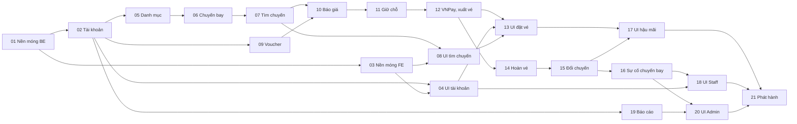

# Lộ trình phát triển SkyLine

| | |
|---|---|
| Ngày | 2026-10-09 |
| Nguồn | [PRD](../../PRD.md) · [TDD](../../TDD.md) · [App Flow](../../APP_FLOW.md) · [Backend Schema](../../BACKEND_SCHEMA.md) · [DESIGN.md](../../../DESIGN.md) |
| Plan chi tiết đã có | [Plan 01 — Nền móng backend](2026-10-09-01-backend-foundation.md) · [Plan 02 — Tài khoản, tham số, khung email](2026-10-09-02-accounts-settings-email.md) · [Plan 04 — Màn hình tài khoản](2026-10-10-04-account-screens.md) |

Hệ thống có 10 module backend, khoảng 70 API, 28 màn hình, 16 test bắt buộc (T1–T16) và 11 kịch bản demo (D1–D11). Một plan duy nhất cho tất cả sẽ quá lớn để làm và review, nên dự án được chia thành **21 plan**. Mỗi plan tạo ra phần mềm chạy được, có test, và review độc lập được.

## Cách dùng tài liệu này

- **Plan chi tiết viết ngay trước khi làm**, theo thứ tự trong bảng §2. Plan sau dùng đúng tên lớp, API và bảng mà plan trước đã tạo thật, nên không viết trước toàn bộ 21 plan.
- **Làm theo nhóm:** các plan không phụ thuộc nhau chạy song song (sơ đồ §3, chia việc §4). **Làm một mình:** đi theo số thứ tự.
- **Xong một plan:** đánh dấu ở cột "Xong" (§2) và bổ sung API mà plan đó tạo ra vào bảng hợp đồng (§6).

---

## 1. Mốc

| Mốc | Plan | Chứng minh được | Tuần (nhóm 5 người) |
|---|---|---|---|
| M0 Nền móng | 01–04 | `docker compose up` chạy, CI xanh, đăng ký và đăng nhập được trên UI | 1–2 |
| M1 Tìm kiếm | 05–08 | Tìm thấy chuyến bay thẳng và nối chuyến trên UI với dữ liệu seed | 3–4 |
| M2 Đặt vé và thanh toán | 09–13 | Kịch bản D1–D5, D11 | 5–7 |
| M3 Hậu mãi và vận hành | 14–18 | Kịch bản D6–D8 | 8–10 |
| M4 Quản trị và phát hành | 19–21 | D9, D10, chạy lại toàn bộ D1–D11 bằng một lệnh `docker compose up` | 10–12 |

Số tuần là ước lượng thô theo bối cảnh PRD §1.1 (nhóm 5 người, 12 tuần).

---

## 2. Danh sách plan

Mức ưu tiên lấy từ PRD §5: **P0** bắt buộc cho demo cốt lõi, **P1** cần có, **P2** làm nếu còn thời gian.

| # | Plan | Chức năng | Quy tắc | Test bắt buộc | Cần có trước | Kết quả kiểm chứng được | Ưu tiên | Xong |
|---|---|---|---|---|---|---|---|---|
| 01 | Nền móng backend | — (NFR-03, 04, 07, 08, 10) | BR-25 (đọc tham số) | T15 (phân quyền theo đường dẫn) | — | `./mvnw verify` xanh trên PostgreSQL 18; `docker compose up` healthy; CI chạy | P0 | ☑ |
| 02 | Tài khoản, phiên đăng nhập, tham số, khung email | FR-01–04, FR-110, FR-111, email đặt lại mật khẩu (FR-130) | BR-100–105, BR-25 | — | 01 | Đăng ký, đăng nhập, khoá tài khoản qua API; email đặt lại mật khẩu xuất hiện trong Mailpit; seed `V105` | P0 (FR-01, 02), còn lại P1 | ☑ |
| 03 | Nền móng frontend | — (NFR-09, DESIGN.md) | — | — | 01 | `npm run build` và Playwright smoke xanh; `/api/*` đi qua rewrites; route cần đăng nhập chuyển về `/login?next=` | P0 | ☑ |
| 04 | Màn hình tài khoản | C-03–C-06, C-12 | — | — | 02, 03 | E2E: đăng ký → đăng nhập → sửa hồ sơ → đăng xuất | P0 (C-03, C-04) | ☑ |
| 05 | Danh mục | FR-10, FR-80–83 và API công khai `/airports`, `/airlines`, `/baggage-options` | BR-90–92 | — | 02 | CRUD của Admin, xoá dữ liệu đã tham chiếu báo `RESOURCE_IN_USE`; seed `V100`–`V103` | P0 (FR-83: P1) | ☐ |
| 06 | Quản trị chuyến bay và kho ghế | FR-90, FR-91, FR-92 (chưa gửi email), FR-94; `SeatInventory` (Q-01–Q-03) | BR-80–82, BR-85–87 | Kho ghế dưới tải đồng thời (tiền đề cho T1) | 05 | Tạo hàng loạt bỏ qua ngày trùng; không giảm ghế xuống dưới số đã bán; seed `V106` (1.200 chuyến) | P0 (FR-92: P1, FR-94: P2) | ☐ |
| 07 | Tìm chuyến | FR-11, FR-12; `FlightApi` kiểm tra và định giá hành trình | BR-01–06, BR-20, BR-21 | T13 | 06 | HAN→PQC trả cả chuyến thẳng lẫn nối chuyến; p95 dưới 1 giây trên dữ liệu seed (NFR-01) | P0 | ☐ |
| 08 | Màn hình tìm chuyến | C-01, C-02 | — | — | 03, 05, 07 | E2E: tìm khứ hồi 2 bước, lọc và sắp xếp ở client | P0 | ☐ |
| 09 | Voucher | FR-100; `VoucherApi` | BR-30 (điều kiện 1–4), BR-31, BR-32 | — | 02 | CRUD voucher; giữ và trả lượt nguyên tử (Q-14, Q-15); seed `V104` | P1 | ☐ |
| 10 | Báo giá booking | FR-20–23 | BR-10–14, BR-20–24, BR-30 (điều kiện 5), BR-33 | — | 07, 09 | `POST /bookings/quote` cho đúng các con số của ví dụ TDD §8.8 (tổng 5.848.000 đ) | P0 (FR-22, 23: P1) | ☐ |
| 11 | Giữ chỗ và vòng đời booking | FR-24, FR-33, FR-40, FR-41, FR-70 | BR-40, BR-45, BR-46, BR-104 | T1, T2, T5, T15 (404), T16 | 10 | 20 luồng đặt cùng lúc không bán vượt ghế; job hết hạn trả ghế và lượt voucher | P0 | ☐ |
| 12 | Thanh toán VNPay và xuất vé | FR-30, FR-31, FR-32 (phát sự kiện), FR-73, email vé | BR-41–44 | T3, T4 | 11 | Thanh toán sandbox → `ISSUED`, số vé 13 chữ số, email vé trong Mailpit | P0 (FR-73: P2) | ☐ |
| 13 | Màn hình đặt vé và quản lý booking | C-07, C-08, C-09 | — | — | 04, 08, 12 | E2E: chọn vé → khai hành khách → giữ chỗ → chuyển sang VNPay | P0 | ☐ |
| 14 | Hoàn vé | FR-50–52, FR-71, yêu cầu hoàn tự tạo (FR-32), email hoàn tiền và từ chối | BR-44, BR-50–53, BR-60–66 | T6, T7, T8, T14 | 12 | Staff duyệt → Refund API (giả lập) → `COMPLETED`; lỗi cổng thì thử lại chỉ hoàn phần thiếu | P1 | ☐ |
| 15 | Đổi chuyến | FR-60–62, email đổi chuyến | BR-70–75 | T9, T10, T11 | 14 | Đổi chiều về, trả phí và chênh lệch, có số vé mới | P1 | ☐ |
| 16 | Sự cố chuyến bay và manifest | FR-93, FR-72, email đổi giờ (FR-92), email huỷ chuyến | BR-83, BR-84 | T12 | 15 | Huỷ chuyến kéo theo đủ 4 hệ quả (a)–(d) của BR-84 | P1 (FR-72: P2) | ☐ |
| 17 | Màn hình hậu mãi | C-10, C-11 | — | — | 13, 15 | E2E: hoàn một chiều, đổi một chiều | P1 | ☐ |
| 18 | Màn hình Staff | S-01–S-06 | — | — | 04, 16 | E2E: tra cứu booking, duyệt yêu cầu hoàn | P0 (S-01, S-02), còn lại P1 | ☐ |
| 19 | Báo cáo | FR-120–122 | BR-110–112 | — | 02 | Số liệu khớp với dữ liệu test tự dựng | P1 (FR-122: P2) | ☐ |
| 20 | Màn hình Admin | A-01–A-10 | — | — | 04, 16, 19 | E2E: tạo chuyến hàng loạt rồi thấy chuyến đó trong kết quả tìm kiếm | P0 (A-01–A-06), còn lại P1 | ☐ |
| 21 | Phát hành và demo | D1–D11, NFR-01, NFR-08 | — | E2E toàn luồng | tất cả | `docker compose up` một lệnh; D1–D11 chạy được, có kịch bản thuyết trình | P0 | ☐ |

**Đã làm trước thứ tự plan (chưa tick "Xong"):**

- **Plan 08:** đã có phần giao diện của C-01 (`frontend/src/components/landing/`), dựng từ bản thiết kế Claude Design. Ô tìm chuyến dùng danh sách sân bay mẫu (`data.ts`) và chuyển tới `/flights?...`. Còn thiếu: nối `GET /airports` (Plan 05), toàn bộ C-02 (Plan 07 cung cấp API) và E2E.

Kiểm tra độ phủ: mọi `FR-xx` của PRD §5, mọi `BR-xx` của PRD §6, mọi test T1–T16 của TDD §11.2, mọi email của FR-130 và mọi màn hình của APP_FLOW §2 đều thuộc đúng một plan ở bảng trên.

---

## 3. Sơ đồ phụ thuộc

Mũi tên `A --> B` nghĩa là B cần A xong trước. Sơ đồ đã bỏ các cạnh suy ra được qua bắc cầu.

Đường găng (dài nhất): 01 → 02 → 05 → 06 → 07 → 10 → 11 → 12 → 14 → 15 → 16 → 20 → 21. Mọi trễ trên đường này làm trễ cả dự án; các plan còn lại có thời gian dự phòng.

---

## 4. Chia việc

### Nhóm 5 người

Theo cách chia ở TDD §3.4. Mỗi nhóm làm cả màn hình cho phần backend của mình, vì DESIGN.md đã có.

| Nhóm | Phụ trách | Plan |
|---|---|---|
| A | common, identity, notification | 01, 02, 04, 18 |
| B | catalog, flight | 05, 06, 16, 20 |
| C | tìm kiếm, booking | 07, 08, 10, 11, 13 |
| D | payment, aftersales | 12, 14, 15, 17 |
| E | promotion, report, nền frontend, phát hành | 03, 09, 19, 21 |

Tuần 1, khi nhóm A làm Plan 01, các nhóm khác chuẩn bị: nhóm D đăng ký VNPay sandbox (§7), nhóm E dựng khung giao diện theo DESIGN.md, mọi người đọc PRD và TDD phần mình phụ trách.

### Làm một mình

Đi theo số thứ tự 01 → 21. Toàn bộ 21 plan khó xong trong 12 tuần bán thời gian, nên làm **đường P0** trước:

01, 02 (FR-01, 02), 03, 04 (C-03, C-04), 05 (FR-10, 80–82), 06 (FR-90, 91), 07, 08, 10 (bỏ hành lý, voucher), 11, 12 (bỏ FR-73), 13, 18 (S-01, S-02), 20 (A-01–A-06), 21.

Đường P0 đủ chạy D2, D3, D4, D5, D11 và D1 rút gọn (không hành lý, không voucher). Sau đó quay lại phần P1, P2 của từng plan.

---

## 5. Quy ước chung

Plan 01 thiết lập các quy ước dưới đây; mọi plan sau tuân theo.

### Backend

- **Module:** gói gốc `vn.edu.uit.flightbooking`, mỗi module là một gói con. Gói con `web`, `domain`, `infra` là nội bộ; lớp ở gói gốc của module là API công khai (TDD §3.2). `ModularityTest` chặn vi phạm.
- **API công khai** của module là một class `@Service` ở gói gốc (VD `common.SettingsApi`). Chỉ tách interface khi có từ hai cài đặt trở lên.
- **Lỗi nghiệp vụ:** `throw new BusinessException(ErrorCode.X, "câu tiếng Việt cho người dùng")`. Trường bổ sung truyền qua `Map`, VD `Map.of("reason", "EXPIRED")`.
- **Tham số hệ thống:** gọi `settingsApi.getInt(SettingKey.X)` đúng lúc tạo giao dịch (BR-25).
- **Migration:** thay đổi schema thêm vào `db/migration/V{n}__mo_ta.sql` (V2, V3…), không sửa V1. Seed đặt ở `db/seed/V10x__seed_*.sql`, đánh số theo BACKEND_SCHEMA §8. Plan 02 thêm `classpath:db/seed` vào `spring.flyway.locations` và bật `spring.flyway.out-of-order=true` cho profile `dev`, vì các plan thêm seed không theo thứ tự số (V105 ở Plan 02, V100–V103 ở Plan 05…).
- **Test:**
  - Integration test gắn `@IntegrationTest` để dùng chung một Spring context và một container PostgreSQL 18.
  - Test ghi dữ liệu thì gắn `@Transactional` để rollback. Riêng test đồng thời không dùng được cách này, nên phải tự tạo dữ liệu riêng và tự dọn.
  - Test tự tạo dữ liệu, không dựa vào seed.
  - CSRF trong test: dùng `TestCsrf.csrf(mvc)`. **Không** dùng `SecurityMockMvcRequestPostProcessors.csrf()`, vì nó thay repository của `CsrfFilter` dùng chung và làm hỏng các test chạy sau.
  - Test không đọc `.env` (chỉ profile `dev` đọc file này).
- **Commit:** nhỏ, mỗi task một lần; message dạng `feat(module): ...`, `test(module): ...`.

### Frontend (Plan 03 thiết lập)

- Landing (C-01) giữ nguyên CSS của bản thiết kế trong `landing.css` (scope `.sk`) thay vì chuyển sang Tailwind, để đối chiếu bằng diff khi thiết kế đổi. Các màn sau dùng token `@theme`.
- Next.js 16 bật Cache Components: không gọi `new Date()` hay `Date.now()` khi render (kể cả Client Component). Giá trị phụ thuộc giờ phải lấy sau hydrate, VD `useSyncExternalStore` với `getServerSnapshot` trả `null` (xem `search-context.tsx`).
- Token màu, chữ, khoảng cách lấy từ DESIGN.md và khai báo trong `@theme` của Tailwind v4.
- Mọi lời gọi ghi đi qua một hàm `apiFetch` duy nhất (tự gắn `X-XSRF-TOKEN`, chuyển ProblemDetail thành lỗi có `code`).
- Kiểu dữ liệu API sinh bằng `npm run gen:api` từ OpenAPI của backend vào `src/lib/api-types.ts`. Plan nào thêm hoặc đổi API thì chạy lại lệnh này và commit file sinh ra.
- Giờ hiển thị theo múi giờ của sân bay (TDD §7). Tên hành khách chuẩn hoá thành chữ in hoa không dấu trước khi gửi.

---

## 6. Hợp đồng giữa các plan

Cột "Tạo ra" liệt kê những gì plan sau được dùng. Plan nào xong thì cập nhật dòng của mình theo code thật. Các dòng "dự kiến" lấy tên từ TDD §3.2 và sẽ được chốt khi viết plan tương ứng.

| Plan | Tạo ra |
|---|---|
| 01 | `ErrorCode` (24 mã của TDD §9, `status()`), `BusinessException(code, detail[, properties])`, `GlobalExceptionHandler` (ProblemDetail có `code`, lỗi validation có `errors`), `SecurityConfig` (bảng quyền TDD §4.3, `ROLE_ADMIN > ROLE_STAFF`, CSRF SPA), `GET /api/auth/csrf` (204 + cookie `XSRF-TOKEN`), `SettingKey` (`key()`, `min()`, `max()`), `SettingsApi.getInt(SettingKey)`. Test: `@IntegrationTest`, `TestCsrf.csrf(mvc)`, `TestcontainersConfiguration` |
| 02 | `Role` (`CUSTOMER`, `STAFF`, `ADMIN`) và `CurrentUser(id, role)` ở `common`. `CurrentUser` là principal trong session; controller nhận bằng `@AuthenticationPrincipal CurrentUser me`. `BusinessException.invalidField(field, message)` (400 có `errors`). `SettingKey.of(key)`, `SettingsApi.list()`, `SettingsApi.update(key, value, updatedBy)`. `identity.UserApi.get(id) → UserSummary(id, email, fullName)`. Sự kiện `identity.PasswordResetRequested(userId, rawToken)`. Khung email: `notification.infra.Mailer.send(to, subject, template, variables)` + listener `@ApplicationModuleListener` (đã bật `@EnableAsync`), template ở `templates/email/`. Phân trang trả `new PagedModel<>(page)`. Seed `V105` (3 tài khoản, mật khẩu `Demo@1234`); profile `dev` nạp `db/seed` với `out-of-order`. Test: `TestUsers.loggedIn(mvc, jdbc, role)`, `TestUsers.login(mvc, email, password)`, `TestMailSender.sentTo(email)` |
| 03 (phần lớn làm cùng Plan 04) | Token `@theme` trong `src/app/globals.css`: màu DESIGN.md và màu theo vai trò (`ink`, `paper`, `muted`, `line`, `btn`... tự đổi ở chế độ tối), thang chữ `text-caption` … `text-hero` (line-height px), `--spacing: 1px`, `rounded-pill`, `max-w-page`. `rewrites` `/api/:path*` → `BACKEND_URL` (mặc định `http://localhost:8080`). `src/lib/api.ts`: `apiFetch<T>(path, {method, body})` (tự lấy và gửi `X-XSRF-TOKEN`), `ApiError(status, code, detail, errors)`, kiểu `User`, `Role`, `homeOf(role)`, `safeNext(next, role)`. `src/proxy.ts` chặn `/account`, `/bookings`, `/staff`, `/admin` khi thiếu cookie `JSESSIONID`. Playwright: `playwright.config.ts`, thư mục `e2e/`, `npm run e2e`; `e2e/smoke.spec.ts` mở mọi route (route mới thì thêm vào danh sách `PUBLIC` hoặc `PROTECTED`). `npm run gen:api` (cần backend chạy ở cổng 8080) sinh `src/lib/api-types.ts` từ `/v3/api-docs` với cờ `--properties-required-by-default`; file này được commit và không sửa tay. `api.ts` xuất `Schemas = components["schemas"]`, VD `Schemas["UserResponse"]`. CI có job `frontend`: `npm ci`, lint, `npm run build` (build tự kiểm tra kiểu; chưa chạy E2E vì cần backend) |
| 04 | Màn `/login` (C-03, nhận `?next=` và `?reset=1`), `/register` (C-04), `/forgot-password` (C-05), `/reset-password?token=` (C-06) trong route group `(auth)` dùng `AuthShell`; `/account` (C-12). `src/components/form.tsx`: `Field` (nhãn, lỗi, hiện/ẩn mật khẩu, câu báo tiếng Việt cho `required`/`type=email`/`pattern`), `Notice`, `FormSkeleton`, `useSubmit()` (lỗi theo trường lấy từ `errors` của ProblemDetail), class `pillDark`, `pillLine`, `textLink`, `PASSWORD_PATTERN`. `src/components/auth-shell.tsx`: `AuthShell`, `AuthHeading`, `Brand` |
| 05 | Dự kiến: `CatalogApi` |
| 06 | Dự kiến: `FlightApi` (đọc chuyến), `SeatInventory` (giữ, trả, đổi tổng ghế) |
| 07 | Dự kiến: `FlightSearch`, `FlightApi` (kiểm tra và định giá hành trình) |
| 09 | Dự kiến: `VoucherApi` (kiểm tra, tính mức giảm, giữ lượt, trả lượt) |
| 11 | Dự kiến: `BookingApi`, sự kiện `BookingIssued`, `UnexpectedPaymentReceived` |
| 12 | Dự kiến: `PaymentApi`, sự kiện `PaymentSucceeded` |
| 14–15 | Dự kiến: `AftersalesApi`, sự kiện `RefundCompleted`, `RefundRejected`, `RescheduleCompleted` |

---

## 7. Quyết định cần chốt

1. **Plan 01 có 4 điểm cố ý khác TDD.** Nếu bạn không đồng ý điểm nào, báo lại để sửa plan trước khi làm.
   - `SettingsApi` đọc DB mỗi lần gọi, không cache (TDD §6.9 ghi có cache). Mỗi lần đọc là một lần tra khoá chính, khoảng 1 ms. Bù lại, giá trị không bao giờ bị cũ và không cần logic làm mới cache.
   - `GET /api/auth/csrf` trả `204`; token nằm trong cookie `XSRF-TOKEN` (TDD §4.2 ghi "trả token"). Với `csrf.spa()`, token trong body bị mã hoá XOR; gửi giá trị đó vào header sẽ bị từ chối, chỉ giá trị trong cookie mới đúng. Trả token trong body chỉ dễ gây nhầm.
   - Lỗi 405, 415 và các lỗi 4xx khác của Spring MVC dùng `code = VALIDATION_FAILED`, vì TDD §9 không có mã riêng cho chúng.
   - Cổng PostgreSQL trên máy host đổi được qua `DB_PORT` trong `.env`. Máy dev hiện tại có PostgreSQL cài dạng Windows service chiếm cổng 5432.
2. **Plan 02 có 3 điểm cố ý khác TDD** (chi tiết ở [Plan 02](2026-10-09-02-accounts-settings-email.md#điểm-cố-ý-khác-tdd)):
   - Đăng nhập tự kiểm tra BCrypt, không dùng `DaoAuthenticationProvider`. Lý do: provider đó báo "tài khoản bị khoá" trước khi kiểm tra mật khẩu, làm lộ trạng thái tài khoản.
   - Chặn phiên của tài khoản bị khoá bằng `HandlerInterceptor` ở `identity`, không bằng filter của Spring Security, vì `common` không được phụ thuộc `identity`.
   - Nhập sai mật khẩu hiện tại khi đổi mật khẩu trả 400 `VALIDATION_FAILED` cho trường `currentPassword`, không trả 401.
3. **DESIGN.md còn 2 lỗi, ảnh hưởng Plan 03.**
   - Các token `--leading-*` không có đơn vị, nên CSS hiểu là bội số cỡ chữ (`17` = 17 lần cỡ chữ).
   - Màu nút chính mâu thuẫn: Components ghi `#000d10`, Agent Prompt Guide ghi `#bc7155`.

   Mặc định của Plan 03: line-height viết theo px qua `--text-*--line-height` của Tailwind v4; nút chính màu `#000d10`; màu clay chỉ dùng cho một card nổi bật mỗi trang.
4. **Token spacing của DESIGN.md trùng thang mặc định của Tailwind.** `--spacing-16: 16px` biến `p-16` thành 16px, trong khi `p-12` (không có token) vẫn là 48px. Mặc định của Plan 03: đặt `--spacing: 1px` để mọi `p-N` đều bằng N px, khớp toàn bộ thang spacing (11, 13, 22, 53, 80, 119…).
5. **Làm nhóm hay một mình?** PRD ghi nhóm từ 5 người, còn bạn có nhắc "đồ án cá nhân". Lộ trình dùng được cho cả hai cách (§4).
6. **Đăng ký VNPay sandbox sớm** tại <https://sandbox.vnpayment.vn/devreg/>. Plan 12 cần `VNPAY_TMN_CODE` và `VNPAY_HASH_SECRET`; VNPay gửi qua email và có thể mất vài ngày.

---

## 8. Rủi ro đã biết

| Rủi ro | Cách xử lý |
|---|---|
| Spring Boot 4, Security 7, Jackson 3 và Next.js 16 còn mới; nhiều ví dụ trên mạng là của bản cũ (VD `spring-boot-starter-web` nay là `-webmvc`, `middleware.ts` nay là `proxy.ts`) | Plan chỉ ghi API đã chạy thử. Plan 01 đã chạy thật trên Boot 4.1.1 |
| Windows: `mvnw` mất quyền thực thi khi commit, CI trên Ubuntu báo `Permission denied` | Plan 01 Task 1 có bước `git update-index --chmod=+x` |
| Testcontainers cần Docker Desktop đang chạy khi chạy `./mvnw verify` | Ghi trong CLAUDE.md (Plan 01 Task 6) |
| IPN của VNPay cần URL công khai | Dùng tunnel khi dev; Return URL là kênh dự phòng (TDD AD-07) |
| Seed chuyến bay sinh theo ngày chạy migration, dữ liệu demo cũ dần | Làm mới bằng `docker compose down -v && docker compose up` |
| Plan sau thay đổi hợp đồng của plan trước | Cập nhật §6 khi xong mỗi plan; đổi hợp đồng thì sửa cả các test đang dùng nó |
